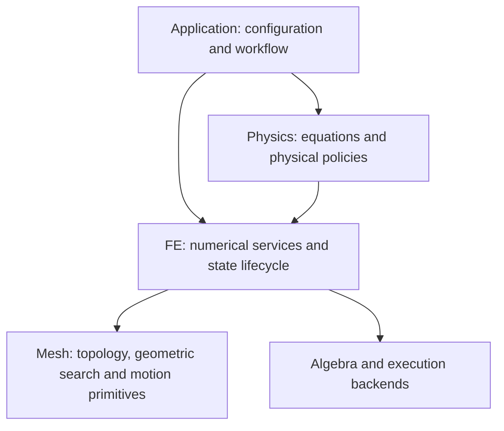

# Free-Surface Architecture Refactoring Implementation Plan

> **For agentic workers:** Use `superpowers:subagent-driven-development` or `superpowers:executing-plans` when implementation is authorized. Execute the work packages in dependency order and retain their review and numerical verification gates. Unchecked boxes describe future work, not completed implementation.

**Goal:** Restore a modular incompressible-flow implementation and reusable moving-domain FE library without changing established numerical behavior during structural refactoring.

**Architecture:** Physics owns governing equations, constitutive and interface laws, and physical acceptance criteria. FE owns generic finite-element technology, geometry, integration, algebraic constraints, and state/history mechanisms. Application translates configuration, composes workflows, and publishes results.

**Tech stack:** Existing C++ FE/Forms and symbolic differentiation, compiled/JIT assembly, CMake, GoogleTest, MPI, and Python qualification tooling. This plan does not require a new dependency or solver framework.

**Spec:** The ownership rules, numerical contracts, file map, and work packages in this document constitute the self-contained change specification. They expand the repository architecture review of the free-surface additions beginning at `0f8ee0d`.

**Review date:** 2026-09-04.

**Documentation supplement:** The configuration migration details below expand the source review into a concrete change specification. They identify existing differences between input paths that must be preserved during extraction or corrected in a separately reviewed behavior change. This supplement does not establish a build, test, or physical qualification result.

**Reviewed branch:** `issue-449-modern-mesh-core`.

**Reviewed committed HEAD:** `905239de40b41aa3ca615305516b600e640d95e4`.

**Implementation status:** Implementation authorized on 2026-09-04. R0 baseline capture and R1 configuration migration are in progress. The Physics option, resolved level-set translator and builder reuse slices are verified; serial and two-rank wet-block references are accepted within their limited scope. R2-R12 remain pending. The original review did not execute solver builds or physical qualification. Completed work is recorded by checked items and dated progress entries below.

**Execution records:** [Coordination notes](free_surface_boundary_unfitted_audit_20260720.md#2026-09-04-architecture-refactoring-coordination) and [owned Slurm job ledger](free_surface_refactor_job_ledger_20260904.md). Commits use Zachary Sexton <zsexton@stanford.edu> and are pushed to `issue-449-modern-mesh-core` after their relevant checks.

**Contents:**

- [Scope and evidence](#1-scope-and-evidence)
- [Target ownership and dependencies](#2-target-ownership-and-dependency-rules)
- [Numerical contracts](#3-numerical-contracts-that-every-extraction-must-preserve)
- [File and component map](#4-proposed-file-and-component-map)
- [Interface contracts](#5-minimal-interface-contracts)
- [Implementation work packages R0-R12](#6-implementation-work-packages)
- [Parameters and runtime policies](#7-parameter-and-runtime-policy-inventory)
- [Verification and qualification](#8-verification-and-qualification-plan)
- [Sequencing and risks](#9-sequencing-integration-and-risk-control)
- [Definition of completion](#10-definition-of-completion)
- [Source and evidence index](#11-source-and-evidence-index)

## Global constraints

- Preserve current formulas, signs, defaults, coefficient values, and supported configurations during extraction. Changes to the numerical method are separate work with separate evidence.
- Keep generic level-set, cut-domain, and fitted moving-mesh methods reusable by physics other than incompressible flow.
- Preserve a single authoritative geometry snapshot and complete state/revision provenance across assembly, constraints, diagnostics, maintenance, and restart.
- Preserve residual/Jacobian semantics, trial-state synchronization, accepted-state publication, rollback, and time-history behavior.
- Preserve MPI ownership rules and use the active system communicator. Do not substitute `MPI_COMM_WORLD` for a system communicator.
- Preserve physical capability restrictions and errors for unsupported combinations until their replacement is independently qualified.
- Preserve the existing uncommitted work. Do not fold it into a claimed committed baseline or revert it as part of this plan.
- Reuse the existing Forms installer, geometry services, constraint mechanisms, and time integrator. Add a cohesive service only where the existing API cannot express the required contract.
- Keep historical qualification bundles and their hashes immutable. New implementation artifacts receive new provenance and manifests.
- Limit implementation to the reviewed OOP free-surface/moving-domain paths and shared services they actually require. Unrelated legacy-solver, solid-mechanics, and backend rewrites are outside scope.

## 1. Scope and evidence

The review inspected the change history, high-impact source paths, existing architecture documentation, unit-test contracts, and selected qualification records. It did not audit every line of every intervening commit or establish that the dirty worktree passes its tests.

The inclusive introduction-to-HEAD history contains 780 commits. Many also change shared infrastructure or add benchmark artifacts; raw repository-wide insertion counts are therefore a poor measure of free-surface complexity.

### 1.1 Concentrations of responsibility

| Source file | Before `0f8ee0d` | At `0f8ee0d` | Reviewed HEAD | Reviewed worktree |
|---|---:|---:|---:|---:|
| `Physics/Formulations/NavierStokes/IncompressibleNavierStokesVMSModule.cpp` | 284 | 424 | 10,580 | 10,592 |
| `Physics/Formulations/NavierStokes/NavierStokesRegister.cpp` | 2,164 | 2,376 | 5,590 | 5,590 |
| `Application/Core/ApplicationDriver.cpp` | 1,036 | 1,036 | 34,944 | 34,954 |
| `Physics/Formulations/NavierStokes/IncompressibleNavierStokesVMSModule.h` | 245 | 289 | 692 | 692 |

Paths in the table are relative to `Code/Source/solver/`. Line counts measure file size, not a target size or proof of a numerical defect.

### 1.2 Worktree changes that need a separate baseline

At review time, 52 tracked files were modified. The changes include marker-and-side cut-adjacent facet selection through forms, symbolic differentiation, compilation, JIT cache identity, assembly, and Navier-Stokes stabilization. This is directionally consistent with a generic FE domain API, but was not validated by this review.

Three untracked WP-10 static-drop files were also present:

- `tests/cases/fluid/free_surface_wp10_static_drop_matrix.json`
- `tests/cases/fluid/run_free_surface_wp10_static_drop_qualification.py`
- `tests/test_free_surface_wp10_static_drop_qualification.py`

The matrix describes a prospective one-step 2D circular-drop prerequisite. It explicitly does not establish spherical balance, sustained dynamics, both-phase mass conservation, high-ratio conditioning, or full WP-10 closure. The existing `svmp_fe_jit_dumps_tests_basis_baking/` directory is a pre-existing artifact, not an output of this review.

Before implementation, record the then-current committed revision and dirty diff separately. A baseline built from the dirty tree must retain that diff and its input/build provenance.

### 1.3 Findings to resolve

| ID | Finding | Required outcome | Work packages |
|---|---|---|---|
| F01 | Bulk Navier-Stokes forms are embedded in a large mixed-responsibility module | Focused Physics operators and a small composition entry point | R3, R4 |
| F02 | A free-surface BC is also used to select a phase volume | Domain selection independent of boundary/interface law | R2, R4 |
| F03 | Application implements reconstruction, equilibrium, history, and numerical maintenance | Application coordinates services with explicit Physics/FE owners | R5, R6, R7, R9 |
| F04 | FE stores fluid energy/contact models and capillary qualification | Neutral geometry and numerical services; physical state and laws in Physics | R5, R7, R8 |
| F05 | Environment switches can alter residuals, coupling, or synchronization | Typed, recorded numerical policies distinct from observation-only diagnostics | R1, R10 |
| F06 | Defaults, parser logic, geometric evaluation, and algebra are duplicated | One owner per policy or operation, with equivalent behavior | R1, R6, R10 |
| F07 | Fitted/ALE machinery and physical interface kinematics are intertwined | Reusable FE mesh-motion technology with Physics-supplied trace relations | R9 |
| F08 | Rootless support handling includes a physical feature-removal decision inside FE | Generic support classification plus explicit selected treatment and accounting | R8 |
| F09 | Runner inheritance, large fixtures, and source-layout checks hinder maintenance | Shared qualification utilities, contract-based tests, immutable archives | R11 |
| F10 | Prerequisite results can be mistaken for full physical qualification | Explicit capability/evidence ledger and unchanged open numerical gates | R0, R11, R12 |

### 1.4 What to retain and what to simplify first

The main problem is the concentration and duplication of decisions. Retain the shared Forms installer, generated-domain infrastructure, symbolic differentiation, cut integration, level-set transport, constraint machinery and moving-mesh services. The refactor should make those services easier for other formulations to consume.

Start with the ownership boundaries that prevent further duplication: typed configuration, explicit integration domains, and a bulk Navier-Stokes contribution. Moving a large helper into another file without changing its inputs and responsibilities does not resolve the dependency problem. Likewise, putting a fluid law behind a callback does not make the law itself an FE responsibility; only the mechanism invoking that callback belongs in FE.

Do not create every proposed file in Section 4 at once. Introduce a component when its extraction produces a tested public contract or a cohesive private implementation. Keep small contact-law helpers together until their consumers justify a separate component. Remove the old numerical implementation when its callers migrate so the split reduces the maintained code rather than retaining two versions.

## 2. Target ownership and dependency rules

### 2.1 Layer responsibilities

| Concern | FE owns | Physics owns | Application owns |
|---|---|---|---|
| Level-set transport | Scalar transport discretization, FE field evaluation, stabilization mechanisms, reinitialization and correction algorithms | Transport velocity selection, phase interpretation, physical boundary data and admissible maintenance policy | Resolve fields/options and schedule the selected services |
| Conservative phase transport | Generic bounded transport, control-volume/flux bookkeeping, moment reconstruction | Meaning of phases and model-specific inventory/acceptance criteria | Execution, restart, reporting |
| Cut geometry | Negative/positive domains, interface and clipped-boundary rules, normals, moments, ownership, revision identity | Select physical support and orient physical laws | Bind configured geometry sources |
| Fitted moving domains | ALE maps, geometry history, artificial mesh smoothing, generic trace constraints and geometric-conservation machinery | Physical interface kinematics and coupling laws | Bind and coordinate mesh-motion and physical modules |
| Weak boundary enforcement | Trace, projection, quadrature, generic Nitsche building blocks and certificates | Stress/flux law and its consistent adjoint; material/time-dependent coefficients | Translate boundary names and configuration |
| Aggregation | Candidate discovery, deterministic roots, basis extension, affine constraints, support diagnostics | Select the supported space/treatment policy and interpret physical consequences | Record effective policy and support-removal events |
| Free-surface energy | Geometry measures/variations, integration, residual pairing and reductions | Surface/Young energy, pressure signs, kinetic energy, dissipation and equilibrium acceptance | Publish immutable energy records |
| Nonlinear lifecycle | State/history storage, revisions, synchronization hooks, transactions and collective agreement mechanisms | Physical acceptance and repair closure | Compose and execute the workflow |
| Configuration | Validate numerical service arguments and capabilities | Validate physical option combinations | Parse XML/environment/aliases, resolve precedence, serialize effective configuration |

### 2.2 Dependency direction



Enforce these rules in library dependencies and public headers:

1. FE production targets do not depend on Physics or Application targets/headers.
2. FE APIs do not encode fluid laws merely by accepting them through an untyped metadata map.
3. Physics may pass coefficients, fields, trace expressions, objective callbacks, and acceptance results to neutral FE services.
4. Application may use both layers but does not reconstruct physical residuals or numerical algorithms during logging/output.
5. Generic time stepping does not enumerate capillary models, Ren-E laws, or free-surface energy channels.
6. Metadata remains typed where it protects correctness: operator identity, active side, stage, source revision, and availability are not optional strings.

### 2.3 Important distinctions

- A scalar advection or level-set algorithm is reusable FE technology even though it is expressed as a PDE. Its velocity/source/boundary inputs are supplied by its consumer.
- Navier-Stokes VMS/PSPG remains Physics because its strong residual, stress, and scaling depend on the fluid equations. FE owns reusable stabilization operators and metrics.
- Artificial harmonic/pseudoelastic mesh smoothing is FE technology. Physical solid elasticity and fluid-solid traction/kinematic laws remain Physics.
- Geometric contact intersections, wall measures, conormals, and normal constraints are FE concepts. Young coefficients, equilibrium angles as a material law, Ren-E friction, and Navier-slip parameters belong to Physics.
- FE can provide generic minimization or projection machinery. A static-capillary workflow and its pressure/energy qualification are Physics responsibilities.
- A generated region and an exterior boundary condition are separate objects. Restricting a bulk equation to one side of an interface must not require inventing an exterior free-surface law.

## 3. Numerical contracts that every extraction must preserve

### 3.1 Geometry and domain identity

Every form, diagnostic, constraint update, and output record consuming generated geometry must identify the same domain, active side, source field and source revision, mesh configuration, topology, ownership, FE layout, and operator stage as required by the existing contracts.

Retain separate invalidation decisions for geometry, topology, numbering, ownership, field layout, constraint layout, and sparsity. Do not make every change trigger a global rebuild, or make a geometry-only refresh reuse stale algebraic state.

Preserve complementary volume/boundary partitions, exactly dry contributions, quadrature moments, orientation, and retained/pruned support accounting. A Physics energy evaluator may consume an FE snapshot; it must not build a second approximation of that geometry.

### 3.2 Residual, tangent, and nonlinear-state semantics

The supported differentiated-geometry and refreshed-frozen-geometry routes are different numerical algorithms. A refreshed-frozen Jacobian may hold generated geometry fixed during differentiation while the residual still refreshes geometry at its declared nonlinear synchronization point.

Preserve the distinction between evaluating `R(x, G(x))` at each trial and evaluating a fixed-point surrogate with lagged `G`. Keep existing topology-epoch restrictions on shape derivatives. Do not enable incomplete normal/projector/point-location derivatives to make an extraction appear more general.

Preserve test/trial field ordering, phase/block identity, current versus historical pressure stabilization, cross-coupling, and moving-control-volume terms. Compare the full residual and Jacobian blocks, not only a scalar norm.

### 3.3 Capillary and contact balance

Preserve the active-liquid outward-normal convention and curvature sign. For the applicable one-phase static case, the pressure jump is `p_liquid - p_ext = gamma * kappa` under the declared convention.

Surface, wetted-wall, and volume first variations must use the same geometry, quadrature, trace space, and constraints as production assembly. Dynamic contact friction and wall-slip dissipation must retain their signs and ownership. A surface-energy term paired with Young-wall energy must not acquire a second equilibrium contact force during composition.

Do not replace production surface forces by a projection into the pressure range. Existing pressure-representability/KKT calculations remain diagnostics or acceptance evidence with their current meaning.

### 3.4 Transport, support changes, and conservation

Preserve the distinction among transported phase inventory, represented geometric volume, reinitialization displacement, global volume correction, local moment correction, pruning, aggregation projection, and velocity extension.

A bound-rejection gate is not a flux correction or a conservation proof. Global volume correction is not local conservative transport. Homogeneous removal of a rootless component is a feature-removal event; record its consequences rather than treating its missing content as a conservative representation.

### 3.5 History and transactions

Preserve separate state and rate histories, BDF history, generalized-alpha stage/end-point relationships, prescribed coefficients, mesh fields, and published snapshots. Candidate evaluation must not silently modify accepted state.

Before collective publication, failures must produce consistent decisions and restore all participating candidate state. Preserve the existing distinction between reversible preparation and publication that cannot honestly be described as rolled back after partial external state mutation.

### 3.6 MPI and execution paths

Preserve owner-authoritative data, relevant ghosts for assembly, owned-only global reductions, deterministic physical root identities, and collective failure propagation. Repartitioning or algebraic renumbering must not change physical aggregation selection.

Preserve domain/side identity through interpreted and JIT forms, cache keys, assemblers, and diagnostics. Unsupported backend capabilities must remain explicit errors or explicitly selected fallback policies.

## 4. Proposed file and component map

Throughout this document, paths beginning with `FE/`, `Physics/`, or `Application/` are relative to `Code/Source/solver/`. A `.h/.cpp` suffix means the corresponding header and implementation files. Proposed filenames are planned additions; they are not claims that these APIs already exist. Keep headers and implementations together where both are listed. Reuse an existing component instead of creating the proposed file when it already provides the same responsibility and contract.

### 4.1 Physics components

| Existing concentration | Planned owner/location | Responsibility |
|---|---|---|
| Bulk forms inside `IncompressibleNavierStokesVMSModule.cpp` | `Physics/Formulations/NavierStokes/NavierStokesBulkForms.h/.cpp` | Material/stress, Galerkin and VMS/PSPG expressions; no parsing, MPI reduction, or output serialization |
| Physical free-surface residuals inside the same module | `Physics/Formulations/NavierStokes/FreeSurface/FreeSurfaceForms.h/.cpp` | Exterior pressure, capillary traction/surface stress, contact and fluid kinematic contributions |
| Free-surface cut coefficient selection and support-policy validation | `Physics/Formulations/NavierStokes/FreeSurface/FreeSurfaceNumericalPolicy.h/.cpp` | Fluid stabilization scaling and admissible physical discretization choices |
| Physics options embedded in the large module header | `Physics/Formulations/NavierStokes/FreeSurface/FreeSurfaceOptions.h` | Physical boundary options and fitted/unfitted alternatives; reuse FE numerical option types |
| Physical state currently in FE `FESystem` | `Physics/Formulations/NavierStokes/FreeSurface/FreeSurfaceState.h/.cpp` | Typed physical declarations, accepted energy/capillary history and applicability |
| Snapshot physical functionals, Application energy calculations | `Physics/Formulations/NavierStokes/FreeSurface/FreeSurfaceEnergy.h/.cpp` | Shared physical functional definitions, residual-work meaning and energy records |
| `FE/LevelSet/LevelSetStaticCapillaryEquilibrium.*` and driver capillary initialization | `Physics/Formulations/NavierStokes/FreeSurface/StaticCapillaryEquilibrium.h/.cpp` | Capillary initialization, physical objective composition and acceptance certificates |
| `FE/Interfaces/IncompressibleTwoFluidDiagnostics.*` | `Physics/Formulations/NavierStokes/IncompressibleTwoFluidDiagnostics.h/.cpp` | Fluid jump, traction, penalty and phase-energy diagnostics using shared physical expressions |

Retain the existing one-phase and two-fluid module entry points as composition adapters. Do not create a second hierarchy of generic physics-module base classes. Contact helpers can remain private to `FreeSurfaceForms.cpp` until a separate public contact-law consumer requires otherwise.

### 4.2 FE components

| Existing source | Planned FE home | Required boundary |
|---|---|---|
| `FreeSurfaceGeometrySnapshot.*` geometry portion | `FE/Interfaces/InterfaceGeometrySnapshot.h/.cpp` | Neutral snapshot, measures, geometric variations, provenance and immutable rules |
| Private active-volume helper types and dispatch | `FE/Forms/IntegrationDomain.h/.cpp` with existing domain/context services | Typed domain selection and expression integration; no liquid/exterior semantics |
| Repeated mapping and sample construction | Existing `FE/Geometry/MappingFactory`, `FE/LevelSet/LevelSetCellEvaluator`, and an extracted `FE/LevelSet/LevelSetSampling.h/.cpp` where necessary | Reusable geometry/field sampling; no capillary law |
| `Application/Core/LevelSetVelocityExtensionMap.*` numerical construction | `FE/LevelSet/LevelSetFieldExtension.h/.cpp` | Field extension/reconstruction with supplied side, trace constraints and numerical policy |
| Driver conservative phase geometry reconciliation | `FE/LevelSet/LevelSetPhaseGeometryReconciliation.h/.cpp` using existing conservative-phase state/operator APIs | Match declared phase moments within supported geometry and transaction contracts |
| Driver/app maintenance history algebra | Existing `FE/TimeStepping/TimeHistory`, `TimeSteppingUtils`, plus `FieldMaintenanceHistory.h/.cpp` if needed | Scheme-consistent state/rate repair with explicit policy inputs |
| Driver maintenance transaction machinery | Existing `FE/Systems/GeometryTransaction` and cut-context transactions; `GeneratedStateTransaction.h/.cpp` only for missing composition | Typed candidate/commit/rollback across participating numerical state |
| Geometry-level minimization loop inside static-capillary code | `FE/Math/ConstrainedShapeMinimizer.h/.cpp`, only after separating physical callbacks | Objective/constraint optimization and topology/step safeguards without capillary criteria |
| Artificial fitted mesh methods | Existing `FE/MovingMesh`, `FE/Systems/ALEBinding`, `FE/Constraints/MovingConstraintComposition`, and `FE/TimeStepping/MovingMeshTimeIntegration` | General moving-domain technology |

FE snapshot compatibility headers must not include Physics headers. A neutral old-name alias can temporarily forward geometry-only uses; callers of moved physical APIs must migrate to Physics explicitly.

### 4.3 Application and qualification components

| Planned location | Responsibility |
|---|---|
| `Application/Core/MovingDomainWorkflow.h/.cpp` | Coordinate FE services and Physics callbacks using existing nonlinear/time-loop hooks |
| `Application/Core/ResolvedMovingDomainConfiguration.h/.cpp` | One resolved configuration with source/precedence information, numerical options and physical module options |
| Existing `Application/Translators/LevelSetEquationTranslator.*`, `EquationTranslator.*` | Parse aliases and external inputs into that configuration |
| `Application/Core/MovingDomainArtifactWriter.h/.cpp` | Serialize effective configuration and immutable diagnostics; no numerical recomputation |
| Existing `Application/Core/ActiveDomainOutput.*` and output services | Publish accepted geometry/field views with explicit active-domain semantics |
| `tests/cases/fluid/qualification_support/` | Shared Python execution, provenance and metric utilities for maintained qualification runners |

The new Application coordinator is not a destination for moving the driver's entire anonymous namespace. Its members should hold service handles/configuration and lifecycle state, not implement reconstruction, physical energy, or time-discretization formulas.

## 5. Minimal interface contracts

These contracts describe the intended public boundary. Implementers must reuse the repository's actual field, marker, revision, expression, and error types. The snippets show proposed structure rather than a complete drop-in header.

### 5.1 Domain binding

Separate volume, boundary, interface, and facet selection. Reuse existing side enums and generated-domain handles. A volume binding needs either ordinary mesh-region integration or a generated volume identified by source/domain/marker and side. A facet binding carries side when the selected facet set is side-dependent.

```text
Volume integration input:
  mesh region OR generated domain identity + marker + side
  authoritative geometry/context reference
  declared geometry/tangent policy

Surface integration input:
  fitted boundary OR generated interface OR clipped exterior boundary
  authoritative geometry/context reference and normal convention

Facet integration input:
  marker + optional side + derivative order
  generated facet-set identity and revision
```

Binding validation must reject an unavailable domain, incompatible revision, missing side, or unsupported geometry policy before partial installation. The original full-domain and diagnostic smoothed-indicator paths remain explicit alternatives with their current restrictions.

### 5.2 Physics form contribution

Use an immutable result with the coupled residual contribution, required extra trial fields, and named subexpressions needed for diagnostics. Reuse `FormExpr`, `FieldId`, `FormInstallOptions`, and existing contribution metadata.

```text
Physics input:
  resolved physical options + bound fields + FE domain bindings

Physics output:
  coupled residual expression
  additional trial-field dependencies
  named physical subexpressions and their applicability
  declarations needed for initialization, constraints or physical history

Composition:
  bulk + boundary/interface + selected stabilization/coupling contributions
  -> existing installFormulation/installFormulationWithMetadata entry point
```

A contribution does not directly read environment variables, serialize JSON, issue MPI reductions, or reconstruct cut quadrature. Diagnostic expressions are derived from the production contributions so their formulas cannot drift independently.

### 5.3 Neutral geometry and physical energy

FE supplies area, volume, wall measure, geometric first variation, trace evaluation, and reduction operations. Physics supplies the weights and meanings, for example `gamma * area`, `-gamma * cos(theta_e) * wall_area`, and gravitational potential.

A geometric boundary reconstruction may accept an explicitly supplied normal relation or wall coefficient; FE must not derive that coefficient from a contact-law enum. A generic minimizer accepts objective/constraint evaluations and derivatives, topology identity, and a caller-provided acceptance result. It does not interpret fluid pressure or decide whether capillary qualification is complete.

### 5.4 Generated-state lifecycle

Preserve the following logical sequence while retaining each configured synchronization point and algorithm:

```text
resolved configuration
  -> initialize fields and histories
  -> prepare generated state for the declared nonlinear stage
  -> evaluate residual/Jacobian through FE
  -> restore rejected trial OR retain converged candidate
  -> stage permitted maintenance
  -> collectively validate geometry, constraints, state/rate history and Physics evidence
  -> commit accepted state
  -> publish immutable output/diagnostic records
```

Use explicit outcomes for success, unavailable optional evidence, unsupported configuration, numerical rejection, and unrecoverable publication failure. An unavailable measurement must not be serialized as zero work or zero error.

### 5.5 Resolved configuration and compatibility

Resolve input before registering fields, constraints or forms. The existing private `TranslatedLevelSetTransportInput` already combines an FE space, `LevelSetTransportOptions`, `FormInstallOptions` and projected-curvature field declarations. Make that resolved boundary available to Application consumers instead of rebuilding equivalent options inside the driver.

The proposed records have the following responsibilities. These are interface requirements; the final declarations must use existing repository types and preserve required lifetimes.

| Record/member | Contents and owner | Consumers |
|---|---|---|
| Resolved level-set equation | Equation identity, immutable input snapshot, FE spaces, `FE::level_set::LevelSetTransportOptions`, `FormInstallOptions`, field dependencies and resolved boundary markers | Dependency discovery, preregistration, module creation and maintenance scheduling |
| Resolved generated domain | `LevelSetGeneratedInterfaceOptions` after order resolution, domain/marker/side/retention, input provenance and explicitly supplied order overrides | Domain installation, volume measurements and geometry maintenance |
| Resolved physical boundary | Physics-owned free-surface/contact/material options, bound field/domain identities and boundary-local numerical choices | Physics validation and composition |
| Resolved workflow policy | Initialization/maintenance scheduling, trial-refresh and fixed-point policies, output settings and compatibility mode | Application coordinator |
| Per-value provenance | Canonical key, selected spelling, source layer, whether explicitly supplied, override chain and any compatibility fallback | Effective-configuration output and regression comparisons |
| Mutable workflow state | Initialization flags, accepted targets, accumulated displacement, candidate caches and histories | Runtime workflow only; never part of immutable configuration |

There is an important intermediate state: installation and maintenance do not currently agree for every input. During a structural extraction, one resolver may need to produce explicitly named compatibility views from one immutable input snapshot. Both views must use shared parsing machinery with declared policies, and the effective record must expose any difference. Do not silently copy installation values into maintenance and call that behavioral equivalence.

After characterizing the differences in Section 7.3, converge the views in a separate configuration-contract change. That change must name the affected inputs, selected precedence and expected before/after behavior. The final architecture has one canonical configuration; compatibility views are temporary adapters with a removal gate in R12.

Retain these entry points throughout migration:

- Direct FE callers construct `LevelSetTransportOptions` and use `installLevelSetTransport` without Application or Physics dependencies.
- Direct Physics callers construct `IncompressibleNavierStokesVMSOptions` and call `registerOn`; physical validation remains available on this path.
- `EquationModuleRegistry::create` retains an input adapter for existing registry clients. Typed construction does not require reverse dependencies from Physics to Application.
- Application's `createModule`, `materialInterfaceTransportDependency` and `preRegisterMaterialInterfaceTransportFields` forward to resolved overloads. A workflow that already holds the resolved object must not invoke raw-input translation again.

## 6. Implementation work packages

Each package is an independently reviewable change with a defined numerical gate. Split its mechanical moves into smaller commits when useful, but do not mix numerical retuning into those commits. Use existing behavioral tests for pure moves; add tests where a new public contract, policy boundary, or previously untested failure path is introduced.

### R0. Record the implementation baseline and capability ledger

**Priority:** First. **Dependencies:** None. **Risk:** Low for recording, high if the baseline conflates dirty and committed states.

**Files and evidence:**

- Existing qualification manifests under `tests/cases/fluid/` and immutable records under `Documentation/qualification_logs/`.
- Existing `Code/Source/solver/FE/Docs/LevelSet.md` and `Code/Source/solver/Physics/Docs/NavierStokesFreeSurface.md`.
- Create `Documentation/free_surface_capability_ledger.md` as the maintained index of implementation scope and qualification evidence.
- Create `tests/cases/fluid/free_surface_refactor_baseline.json` as a new baseline manifest with its own schema and provenance.

**Consumes:** Reviewed/current source state and existing test/qualification contracts. **Produces:** The precise source/configuration/build baseline and comparison requirements for all later packages.

- [ ] Record commit, dirty diff/hash, compiler/build flags, backend/JIT settings, MPI implementation/rank count, input checksums, and effective numerical configuration.
- [ ] Inventory all selected cases by physical model, geometry representation, FE space, active side, integration route, tangent policy, stabilization, transport, contact law, and ALE policy.
- [x] Separate entries into implemented behavior, focused prerequisite evidence, physically qualified scope, unsupported configurations, and open numerical requirements. Link every qualification claim to its source revision and frozen record. Completed in the [capability and evidence ledger](free_surface_capability_ledger.md), reviewed against `0d77e6cd` on 2026-09-04.
- [ ] Run the representative baseline suite specified in Section 8. Retain failed, incomplete and unavailable results. An existing failure remains an explicit baseline issue; it does not become a tolerated success.
- [ ] Capture residual vectors and Jacobian blocks after mapping them to stable field/component/physical-DOF identities; retain sparsity, constraint rows, interface/volume moments, and normalized histories.
- [ ] Select comparison tolerances from existing gate definitions and measured backend reduction behavior before running the candidate implementation. Require exact identity for discrete metadata; use declared scaled comparisons for floating-point outputs.
- [ ] Record runtime, peak memory, geometry-refresh counts, cache behavior, iteration counts and output size for representative cases. Use these to detect an architectural extraction that introduces expensive copies or repeated assembly.

**Verification:** The baseline manifest names every selected input and numerical policy, reproduces its recorded results in the designated build, and labels pre-existing failures and missing evidence honestly. Historical records remain byte-identical.

**Suggested commit:** `docs: define free-surface refactor baseline and capability evidence`.

**Progress, 2026-09-04:** The capability ledger passed its scoped review after provenance corrections. The [baseline manifest](../tests/cases/fluid/free_surface_refactor_baseline.json) records frozen source/input identities, the separately preserved original dirty worktree, and inspected build/test outcomes with explicit failures and skips. Five serial Q1 wet-block cases now have accepted full physical operator/constraint/geometry references, unchanged existing gates, repeatable output and independently checked publication behavior. The enabled-feature suite completed all 20 declared groups without failures, with individual skips and its matrix exclusion retained. Five two-rank block-partition Q1 cases also have accepted operator references: independent canonical-identity, ownership, CSR, geometry and numerical-gate checks passed; repeat output is byte-identical and serial payloads remain equivalent. Eight passing fixture spans now retain independently validated functional, contact, phase and cache scalar observations (118 ordered events and seven XML properties). Canonical field maps, setup/exercise classification, full history arrays and per-channel candidate policies remain unavailable in that observation slice. Broader MPI, history, energy and performance references remain incomplete; no remaining R0 checkbox is satisfied by these bounded references and suite outcomes alone.

**Progress, 2026-09-05 (UTC):** Six existing one-rank Application fixtures now have accepted lifecycle references against immutable `0d77e6cd`. These retain scalar P1 field identities and complete observed state/rate arrays, conservative-phase candidate staging and exact rollback, generalized-alpha publication algebra, and synthetic energy-ledger channels with explicit unavailable values. All 147 original assertions remain in order. The two-unit capture build and optional Mesh/MPI-disabled ledger syntax check passed; fourteen runtime groups produced nineteen successful case executions, sixty-six expected refusals and no skips. Independent validation passed 374 checks, including exact numerical repeats, source/link identities, field/graph maps and recomputed algebra. The baseline manifest links the source reviews, failed generations, execution records and acceptance bundle. The R1 driver extraction now has a frozen exact payload-value comparison policy under the recorded one-rank conditions, with candidate source provenance checked separately. These bounded fixtures do not establish a full transient solve, distributed history qualification or baseline-to-candidate equivalence; the remaining R0 gates stay open.

### R1. Introduce one resolved configuration and remove repeated parsing

**Priority:** Early. **Dependencies:** R0. **Risk:** Medium; alias/default precedence can change behavior.

**Modify:**

- `Code/Source/solver/Application/Translators/LevelSetEquationTranslator.h/.cpp`
- `Code/Source/solver/Application/Translators/EquationTranslator.cpp`
- `Code/Source/solver/Application/Core/LevelSetCutConfiguration.h/.cpp`
- Parsing helpers in `Code/Source/solver/Application/Core/ApplicationDriver.cpp`
- `Code/Source/solver/Physics/Formulations/NavierStokes/NavierStokesRegister.cpp`
- `Code/Source/solver/Physics/Formulations/NavierStokes/IncompressibleNavierStokesVMSModule.h`
- Create `Application/Core/ResolvedMovingDomainConfiguration.h/.cpp` and the Physics free-surface option header from Section 4.

**Consumes:** Existing external inputs and FE/Physics option types. **Produces:** An immutable resolved configuration consumed by module installation and the runtime workflow.

- [ ] Extract an inventory of accepted XML names, aliases, environment variables, defaults, precedence rules, units, and current invalid-input behavior. Cover direct programmatic Physics/FE callers as well as XML.
- [ ] Move lexical parsing, face-name resolution, compatibility aliases, and environment reads to Application input adapters. Retain registry adapters for existing callers while forwarding to the typed path.
- [ ] Reuse FE-owned numerical option structs for cut generation, aggregation guards, and history/transport services. Avoid separately maintained copies of the same defaults in Application and Physics.
- [ ] Represent fitted and unfitted geometry configuration as alternatives. Keep exterior one-phase boundary laws distinct from internal two-fluid interface laws and from bulk region selection.
- [ ] Pass the resolved object to both installation and maintenance, retaining explicit compatibility views where Section 7.3 identifies different current semantics. Remove repeated reinitialization, transport-source, geometry-policy, and cut-backend parsing from the driver without silently changing either path.
- [ ] Retain physical validation in Physics and numerical preconditions at FE API boundaries. Preflight all inputs and referenced fields/domains before mutating a system definition.
- [ ] Add effective-value provenance, including whether each value was defaulted, supplied, aliased, or overridden. Serialize the canonical values and the selected algorithm routes.
- [ ] Preserve accepted legacy input behavior during this package. If malformed environment values currently fall back silently, record that compatibility behavior and treat stricter rejection as an explicit later schema/policy change.

**Required cases:** Equivalent aliases resolve identically; conflicting selectors retain their documented precedence/error; unsupported one-/two-fluid scope fails before field/form installation; separate interfaces retain boundary-local options; direct C++ calls retain validation without requiring Application.

**Test owners:** Existing `Application/Tests/Unit/test_LevelSetEquationTranslator.cpp`, `test_LevelSetCutConfiguration.cpp`, `test_EquationTranslator.cpp`, and Physics free-surface configuration/legacy BC tests. Add focused canonical-configuration tests where those fixtures lack a path.

**Implementation slices:**

1. Extract the Physics option declarations into `FreeSurfaceOptions.h`, preserving defaults, enum values, aggregate member order and old public nested names through aliases where needed. Reuse `FE::constraints::SmallCutAggregationGuardOptions`. Compile the header on its own and its direct Physics consumers; run configuration/default and invalid-guard cases before accepting the extraction.
2. Expose the existing typed level-set translation as a pure resolver and add resolved overloads for module creation, dependency discovery and preregistration. Characterize equation/default-domain/domain layering, velocity-source promotion and current errors. Keep the existing raw-input wrappers as compatibility adapters.
3. Replace repeated driver parsing with resolved configuration and separately stored mutable workflow state. Consolidate generated-domain option conversion, preserving omitted-versus-explicit quadrature choices. Exercise both steady and transient setup, maintenance scheduling and direct construction paths.
4. Resolve the characterized input-path disagreements in a separate behavior change. Freeze the selected schema/compatibility policy, input migration rules and expected effective records first. Remove each compatibility view only when its consumers and old-input behavior are accounted for.

**Specific new contract checks:** Compare the options observed by installation and maintenance for the same input; verify equal fields, velocity-source promotion, reinitialization and conservative-phase choices where they currently agree, and explicit recorded differences where compatibility requires them. Exercise equation-only input and conflicting domain overrides. A preflight failure must leave the system definition unchanged, and separate boundaries must retain distinct contact and stabilization values.

**Suggested commit:** `refactor: resolve moving-domain configuration once`.

**Progress, 2026-09-04:** Physics option extraction, pure level-set resolution, builder reuse and retained input snapshots have passed source review and configured checks. The snapshot owns the distinct installation and legacy getter representations; source mutation/destruction cannot change retained values. Seventeen characterization cases preserve current installation/maintenance differences. The snapshot slice passed seven focused cases, all 341 controlled Application cases and all 343 cases after integration through WP-4 `240babd9`, plus two/four-rank consensus on every participant with no skips. The combined `svapplication` library and both test targets built; exact source, binaries, inputs and reviewed evidence are retained in the [baseline manifest](../tests/cases/fluid/free_surface_refactor_baseline.json). The legacy maintenance producer still runs at its existing stage. Shared lexical policies, typed maintenance configuration, the driver state/binding split, cut-option consolidation, physical input adapters and effective-value provenance remain open; R1 is not complete.

**Progress, 2026-09-05 (UTC):** The immutable legacy maintenance producer and shared lexical readers are accepted within their compatibility scope. They retain the separate installation and equation-only maintenance policies, exact existing defaults/errors, active-cut association and source-backed direct/derived velocity history in actual layer order. The new chronological override regression failed on the prior implementation and passes after correction. Source review, seventeen producer cases, seven snapshot cases, twenty-one compatibility cases, all 364 Application cases and every two/four-rank consensus participant passed, with no skips. Two effective records parse strictly and repeat exactly; all 4,670 build inputs are retained. The baseline manifest links the acceptance bundle and failed generations. The production driver still uses its old parser; runtime/binding separation, duplicate-parser removal, cut-option consolidation, physical adapters and full provenance remain open.

### R2. Make integration-domain selection a reusable FE contract

**Priority:** Early. **Dependencies:** R0; consumes R1 configuration adapters when available. **Risk:** High; side and cache identity affect assembly.

**Modify/reuse:**

- `Code/Source/solver/FE/Forms/FormExpr.h/.cpp`, `CutCellForms.h`, `FormIR.h`
- `Code/Source/solver/FE/Assembly/CutIntegrationContext.h` and existing assembler bindings
- `Code/Source/solver/FE/Interfaces/GeneratedActiveBoundaryDomain.h/.cpp`
- `Code/Source/solver/FE/Interfaces/GeneratedInterfaceBoundaryIntersectionDomain.h/.cpp`
- `Code/Source/solver/FE/Systems/FormsInstaller.h/.cpp`
- Existing Forms/JIT lowering, wrapper, and cache-key code where domain identity is represented
- Create `Code/Source/solver/FE/Forms/IntegrationDomain.h/.cpp` only as a thin typed facade over these services.

**Consumes:** Generated domains, existing measures and authoritative context. **Produces:** Explicit volume/surface/facet bindings usable by any formulation, without constructing a free-surface BC.

- [ ] Identify and extract the neutral portions of `ActiveVolumeDomain`, `integrateOnActiveVolume`, `integrateOnFreeSurface`, and shape-tangent domain selection from the Navier-Stokes module.
- [ ] Preserve ordinary full-domain integration, selected cut side, clipped exterior boundary, generated interface, contact intersection, and marked facet integration as distinct supported measures.
- [ ] Carry side identity through form equality/hash, IR, symbolic differentiation, compilation, installed operator metadata, JIT keys/wrappers, every applicable assembler, and diagnostics. Account for the already-present uncommitted side-selection work rather than reimplementing it blindly.
- [ ] Preserve active-only versus active-and-inactive rule retention. Physical assembly selects its own side; an extension or aggregation consumer explicitly declares additional retained support.
- [ ] Preserve exact-zero dry contributions and existing full-cell reuse paths. Reject stale/missing source or unsupported geometry policies at the same contract boundary as before.
- [ ] Extract generic collective measure validation from Navier-Stokes into FE geometry/integration services. Physics still decides when its model requires positive embedded interface measure.
- [ ] Exercise the new binding with a generic scalar diffusion/transport form on a cut region, using FE alone. This demonstrates reuse without adding a new production physics module.

**Required cases:** Integrate constants and linear fields; sum complementary side volumes; reverse side; distinguish two markers; distinguish marker/side facet sets in the cache; reject stale geometry; compare supported interpreted/JIT/parallel paths; preserve full-domain behavior.

**Test owners:** `FE/Tests/Unit/Systems/test_CutIntegrationInfrastructure.cpp`, `FE/Tests/Unit/Forms/test_CutCellForms.cpp`, `test_SymbolicDifferentiation.cpp`, `test_JITCacheKey.cpp`, and existing generated-domain tests.

**Suggested commit:** `refactor: expose physics-neutral integration-domain bindings`.

### R3. Extract the Navier-Stokes bulk formulation

**Priority:** Early. **Dependencies:** R1, R2. **Risk:** Medium if expressions and ordering are retained.

**Modify/create:**

- `Code/Source/solver/Physics/Formulations/NavierStokes/IncompressibleNavierStokesVMSModule.h/.cpp`
- `Code/Source/solver/Physics/Formulations/NavierStokes/NavierStokesBulkForms.h/.cpp`
- Existing `Physics/Core/PhysicsModule` and FE Forms installer are reused, not replaced.

**Consumes:** Bound velocity/pressure/material/forcing/ALE expressions, a volume domain, and resolved VMS options. **Produces:** Bulk coupled residual and named Galerkin/VMS work subexpressions with explicit trial-field dependencies.

- [ ] Extract material/stress construction and the Galerkin momentum/continuity expressions unchanged, including inertia, relative ALE convection, moving-control-volume term, pressure sign, and body force.
- [ ] Extract VMS/PSPG and cross-stress construction unchanged, including the existing metric, effective timestep, stabilization epsilon, pressure-history route, and optional diagnostic numerical alternatives.
- [ ] Return a structured contribution instead of mutating multiple caller-owned forms. Use the same returned expressions for named diagnostic work operators.
- [ ] Keep field registration, initialization, physical validation and boundary composition in the module adapter or the responsible component; exclude them from the bulk expression builder.
- [ ] Remove direct environment reads and JSON/log formatting from the builder. Consume the resolved values without changing their effective meaning.
- [ ] Install the combined formulation using existing mixed-kernel planning and metadata. Preserve field/block ordering and differentiation dependencies.

**Required cases:** Stokes and convective flow, VMS enabled/disabled, constant and supported variable-viscosity paths, fixed and ALE geometry, full and cut volumes, supported pressure-stabilization histories, residual and every Jacobian block. Include a non-free-surface fluid regression so the extraction does not make ordinary flow depend on generated geometry.

**Test owners:** Existing Physics Navier-Stokes tests, `test_MovingDomainPhysics.cpp`, and FE installer/coupled-form tests. Use the R0 captured operator outputs as the comparison reference.

**Suggested commit:** `refactor: isolate incompressible Navier-Stokes bulk forms`.

### R4. Compose boundary and interface physics explicitly

**Priority:** Early/middle. **Dependencies:** R2, R3. **Risk:** High for signs, pressure ownership and double-counting.

**Modify/create:**

- `Physics/Formulations/NavierStokes/FreeSurface/FreeSurfaceForms.h/.cpp`
- Existing `IncompressibleNavierStokesVMSModule.cpp`, `NavierStokesBCFactories.h`
- Existing `IncompressibleTwoFluidModule.h/.cpp` and `IncompressibleTwoFluidInterface.h/.cpp`
- Physical validation and initialization currently embedded in the one-phase module

**Consumes:** Bulk contributions, physical boundary/interface options, FE trace/domain bindings. **Produces:** Exterior-boundary or internal-interface residuals and explicit physical initialization/gauge declarations.

- [ ] Extract exterior pressure, curvature traction, variational surface stress, generated curvature and total-energy-gradient routes into the free-surface Physics component. Preserve all current capability restrictions.
- [ ] Extract pinned/prescribed/dynamic contact behavior with explicit ownership of wall geometry requirements, slip friction and line forces. Keep the current surface/wall pairing and avoid adding a second equilibrium force.
- [ ] Replace the long free-surface helper's optional mutable output pointers with the contribution contract in Section 5.2, including diagnostic applicability.
- [ ] Replace `InternalMaterialInterfaceVolume` use in two-fluid phase setup with explicit phase-local volume bindings. Compose two bulk contributions and the existing two-fluid interface operator under the two-fluid owner.
- [ ] Retain separate phase fields/materials, shared versus phase-local external BC rules, interface orientation, and the common pressure-nullspace/gauge contract. Do not create an independent gauge in each phase automatically.
- [ ] Separate generic active-support/constraint construction from the Physics decision about pressure anchoring and hydrostatic initialization. Validate that requested pressure constraints remain within admissible physical support.
- [ ] Preserve preflight atomicity: a rejected interface or BC configuration leaves fields, forms, constraints and physical history unmodified.
- [ ] Keep unsupported variable-surface-tension, contact, high-order and two-fluid routes explicitly rejected. A cleaner type system does not establish new physical capability.

**Required cases:** Natural zero exterior traction, nonzero exterior pressure, static pressure jump, active-side reversal, phase-label/material exchange, prescribed and dynamic contact signs, no double traction/gauge, invalid configuration before mutation, and all coupled Jacobian blocks supported by the current policy.

**Test owners:** `Physics/Tests/Unit/test_IncompressibleTwoFluidInterface.cpp`, `test_NavierStokesPressureGauge.cpp`, `test_NavierStokesLegacyBCs.cpp`, and the applicable moving-domain/contact tests.

**Suggested commit:** `refactor: compose free-surface and two-fluid interface operators`.

### R5. Separate neutral geometry from physical energy and contact models

**Priority:** Middle. **Dependencies:** R2, R4. **Risk:** High; shared geometry is essential to capillary balance.

**Modify/move:**

- `FE/Interfaces/FreeSurfaceGeometrySnapshot.h/.cpp` -> neutral `InterfaceGeometrySnapshot.h/.cpp`
- `FE/Interfaces/IncompressibleTwoFluidDiagnostics.h/.cpp` -> Physics location in Section 4
- `FE/LevelSet/LevelSetCurvatureProjection.h/.cpp`
- Physical free-surface declarations/histories in `FE/Systems/FESystem.h/.cpp` and their setup/assembly consumers
- Create Physics `FreeSurfaceState.h/.cpp` and `FreeSurfaceEnergy.h/.cpp`

**Consumes:** Authoritative geometric state and composed physical expressions. **Produces:** Neutral FE snapshots/variations and typed Physics functional/diagnostic state with a shared revision identity.

- [ ] Inventory snapshot fields and methods as geometry/provenance, numerical reduction, or physical law/interpretation. Preserve geometry storage and ownership directly; move physical parameters and evaluators to Physics.
- [ ] Move Young-wall coefficients, equilibrium-angle law selection, Ren-E mobility, slip/viscosity, physical energy and dissipation parameters out of the FE snapshot API.
- [ ] Expose geometric area/volume/wall-measure derivatives independently. Change curvature projection inputs to caller-supplied geometric/weighted contributions where the current code computes Young-law weights internally.
- [ ] Share the production stress and penalty specification with two-fluid diagnostics. Retain neutral two-sided field evaluation, mapped gradients and integration in FE.
- [ ] Move capillary method/qualification, physical residual-work channels, physical functional declarations and accepted physical histories out of `FESystem` into the Physics state owner. FE retains operator/stage handles, residual pairing and transaction participation.
- [ ] Adapt Application energy publication to consume the typed Physics record. It must not reevaluate physical formulas during serialization.
- [ ] Preserve required/not-applicable/unavailable distinctions and source-stage provenance. Do not replace typed physical state with arbitrary strings or a generic property bag in FE.
- [ ] Migrate public callers and CMake source ownership. Keep temporary neutral geometry aliases only where they do not reintroduce FE-to-Physics dependencies.

**Required cases:** Same snapshot used by volume, surface, wall and pressure terms; unchanged geometric variations; unchanged physical virtual work; phase-side/sign reversal; matching diagnostic and production traction; unavailable evidence stays unavailable; stale-stage/snapshot access fails.

**Test owners:** Existing geometry snapshot/functional tests, `FE/Tests/Unit/LevelSet/test_LevelSetCurvatureProjection.cpp` and MPI variant, Physics two-fluid tests, and `Application/Tests/Unit/test_FreeSurfaceEnergyLedger.cpp`. Move physical assertions with their owner while retaining cross-layer integration coverage.

**Suggested commit:** `refactor: separate interface geometry from free-surface physics`.

### R6. Extract reusable level-set sampling, extension and phase reconciliation

**Priority:** Middle. **Dependencies:** R1, R2; coordinate geometric projection changes with R5. **Risk:** High for reconstruction and conservation.

**Modify/move:**

- `Application/Core/LevelSetVelocityExtensionMap.h/.cpp`
- `Application/Core/LevelSetCurvatureSamples.h/.cpp`
- `Application/Core/NearestPointIndex.h` where it is part of the numerical algorithm
- Sampling/projection/reconciliation helpers in `Application/Core/ApplicationDriver.cpp`
- Existing FE `MappingFactory`, `LevelSetCellEvaluator`, `LevelSetCurvatureProjection`, `LevelSetVolume`, `LevelSetReinitialization`, and `LevelSetConservativePhase*` services
- Existing `FE/LevelSet/LevelSetVelocityExtensionConstraint.h/.cpp` for installation of extension constraints; reuse its numerical contract instead of adding a parallel constraint implementation
- Create the FE sampling, field-extension, and phase-geometry-reconciliation components in Section 4.

**Consumes:** FE fields/spaces, generic domains, reconstruction policy, supplied boundary constraints and candidate geometry. **Produces:** Revisioned sampled/reconstructed fields, extension rows, and moment-reconciliation results with explicit error/availability information.

- [ ] Move the current extension algorithm intact, including graph construction, regression, normal estimation, wall projection, component selection, amplification checks, and MPI exchange ordering. Rename phase-specific terms in its neutral API without changing their mathematical meaning.
- [ ] Make source side, target field, band selection and trace constraints explicit inputs. Physics/Application select their physical role; FE performs the extension.
- [ ] Separate extension artifact writing from numerical construction. Preserve the immutable extension snapshot and its complete revision identity.
- [ ] Consolidate duplicate cell mapping and supplemental-sample construction through the existing FE mapping/evaluator services. Retain sample order, deduplication rules, tolerances and mapped gradients initially.
- [ ] Move signed-distance repair, volume/moment correction and phase-geometry reconciliation orchestration into cohesive FE services parameterized by the selected policy. Preserve the distinct operations and diagnostics rather than hiding them under a generic repair flag.
- [ ] Keep physical wetting constraints as inputs from the Physics contact model. FE geometry reconstruction must not infer a Young coefficient or select a wall law.
- [ ] Preserve the custom dense solve's pivot/rank rejection when moving it. Compare against `FE/Math/LU.h`; reuse it only if its scaling and failure behavior match, or extend an explicit numerical policy with independent evidence. A library substitution is not assumed equivalent.
- [ ] Remove numerical implementations from the Application helper files after all callers migrate; retain only configuration and output adapters that are still required.

**Required cases:** Constant and linear extension; band exit/re-entry; disconnected support; constrained wall traces; singular/ill-conditioned reconstruction rejection; positive level-set rescaling where the method promises invariance; distributed propagation beyond a single halo; unchanged curvature samples; unchanged phase moments before/after maintenance; raw and corrected inventory reported separately.

**Test owners:** FE LevelSet tests after migration, Application workflow/MPI integration tests, and existing nearest-point/history tests as appropriate. Add a generic scalar/vector extension consumer test independent of Navier-Stokes names.

**Suggested commit:** `refactor: move reusable level-set reconstruction into FE`.

### R7. Extract history, transactions and the moving-domain workflow

**Priority:** Middle. **Dependencies:** R1, R5, R6. **Risk:** Highest; accepted/trial state and MPI publication must remain coherent.

**Modify/create:**

- `Application/Core/ApplicationDriver.cpp`
- `Application/Core/LevelSetMaintenanceHistory.h/.cpp`
- `Application/Core/LevelSetMaintenanceTransactionConsensus.h/.cpp`
- Existing `FE/TimeStepping/TimeHistory.h/.cpp`, `TimeSteppingUtils.h`
- Existing `FE/Systems/GeometryTransaction.h/.cpp` and cut-context transaction APIs
- `FE/LevelSet/LevelSetStaticCapillaryEquilibrium.h/.cpp` and its Physics destination
- FE `FieldMaintenanceHistory`/`GeneratedStateTransaction` only for missing cohesive operations
- Create `Application/Core/MovingDomainWorkflow.h/.cpp`

**Consumes:** Resolved configuration, FE numerical services and Physics state/acceptance callbacks. **Produces:** A workflow coordinator with explicit candidate/accepted lifecycle and reusable history/transaction mechanisms.

- [ ] Extract generalized-alpha and BDF maintenance/history algebra into FE time-stepping services. Preserve stage inversion, rate publication, independently stored histories and all scheme checks.
- [ ] Define typed participation for solution values, rates/history, prescribed coefficients, mesh fields, generated geometry, extension/projection caches, constraints and physical records. Each participant identifies its candidate state and its commit/restore operation.
- [ ] Reuse existing Newton synchronization points and external-state fixed-point controls. Move their wiring to the coordinator without changing which generated quantities refresh at each point.
- [ ] Extract collective preparation/validation/commit consensus while retaining active-communicator behavior. A local exception must lead every rank through the same collective route.
- [ ] Keep preparation reversible and publication boundaries explicit. Preserve the current behavior when a failure occurs after publication starts; do not report a successful rollback of state that was already externally published.
- [ ] Move static-capillary initialization and its pressure-representability/KKT acceptance into the Physics equilibrium component. Preserve unprojected production forces and all geometric/trace compatibility requirements.
- [ ] Extract only the neutral minimization loop into FE if required: caller-supplied objective/constraint values and derivatives, topology/constraint identity, bounded updates, line search and acceptance callback. Keep physical pressure/capillary acceptance outside that loop.
- [ ] Reduce `ApplicationDriver` to building the run, connecting services, invoking the time loop and requesting output. The workflow owns coordination; FE/Physics own numerical/physical operations.
- [ ] Remove duplicate callback implementations after adapting all steady, transient, restart and MPI paths. Retain the same initialization-versus-post-setup ordering.

**Required cases:** Trial sign change; rejected line-search trial; failed curvature projection; failed collective maintenance on one rank; BDF/generalized-alpha history preservation; accepted-step and restart equivalence; steady output refresh; topology/constraint change during capillary trial; unavailable evidence; publication-phase failure. Verify the restored state includes all participants, not only the solution vector.

**Test owners:** `Application/Tests/Unit/test_ApplicationDriverLevelSetWorkflows.cpp`, MPI companion, `test_LevelSetMaintenanceHistory.cpp`, `test_LevelSetMaintenanceTransactionConsensusMPI.cpp`; FE TimeHistory/TimeLoop tests; moved Physics static-capillary tests.

**Suggested commits:** `refactor: centralize generated-state history and transactions`, followed by `refactor: coordinate moving domains through application workflow`.

### R8. Separate cut-support machinery from fluid stabilization policy

**Priority:** Middle. **Dependencies:** R4, R5. **Risk:** High for conditioning, support deletion and conservation accounting.

**Modify/create:**

- `FE/Constraints/SmallCutAggregationConstraint.h/.cpp`
- `FE/Constraints/LevelSetActiveSideVertexDirichletConstraint.h/.cpp`
- Generic cut-adjacent forms, support metadata and trace-certificate services
- `Physics/Formulations/NavierStokes/FreeSurface/FreeSurfaceNumericalPolicy.h/.cpp`
- Physical energy/support-event records and effective configuration

**Consumes:** FE support classification/aggregation and selected Physics numerical options. **Produces:** Generic constraint construction plus explicit selected support/stabilization policy and auditable events.

- [ ] Keep deterministic root search, basis extension, guard checks, distributed reconciliation and affine constraints in FE. Use FE-owned guard types rather than copying defaults into each boundary struct.
- [ ] Expose rootless support as an explicit classification and selected treatment. Preserve the current homogeneous treatment as the migrated default, with its actual feature-removal meaning.
- [ ] Preserve distinct machinery failures, unsupported/truncated support, and true rootless components. A new policy name must not cause previously fatal failures to be silently accepted.
- [ ] Keep pressure/velocity support decisions and pressure-gauge ownership explicit in Physics. Preserve strong-BC precedence and pressure nullspace behavior.
- [ ] Move density/viscosity/timestep-dependent pressure penalty construction and qualification limits into the Physics numerical policy component. FE consumes the resulting coefficient/expression and generic jump/facet operators.
- [ ] Keep aggregation, pressure stabilization and VMS/PSPG separately identifiable in the effective method and energy/work account. Do not treat aggregation alone as evidence of mixed-method stability.
- [ ] Record support-removal events with domain/side/stage identity and available measure/work information. Missing physical consequences remain unavailable rather than being assigned zero.
- [ ] Retain the current supported FE-layout restrictions. Changing root selection, guard bounds, homogeneous treatment, or the retired velocity-penalty decision requires a separate numerical-method change.

**Required cases:** Polynomial reproduction and partition of unity, rootless/disconnected components, bounded extrapolation, strong-BC precedence, high-order layout rejection, deterministic results after partition/numbering changes, phase-side-specific facet support, and unchanged mixed-system residual/conditioning metrics.

**Test owners:** FE aggregation and active-side constraint serial/MPI tests; `Physics/Tests/Unit/test_FreeSurfaceCutStability.cpp`; sharp-boundary/Nitsche tests; Application support/energy output tests.

**Suggested commit:** `refactor: expose cut-support treatment and fluid stabilization policy`.

### R9. Make fitted moving-domain tools reusable FE services

**Priority:** Middle. **Dependencies:** R1, R4, R7. **Risk:** High for ALE time consistency and geometry derivatives.

**Modify/reuse:**

- `FE/MovingMesh/GeometryRegularizationBackend.h/.cpp`
- `FE/Systems/ALEBinding.h/.cpp` and mesh-displacement binding
- `FE/Constraints/MovingConstraintComposition.h/.cpp`
- `FE/TimeStepping/MovingMeshTimeIntegration.h/.cpp`
- Mesh normal/tangential declarations and consumers in `FE/Systems/FESystem`
- `Physics/Formulations/MeshMotion/HarmonicMeshMotionModule.*`, `PseudoElasticMeshMotionModule.*`, `MeshMotionBCFactories.h`, `MeshMotionRegister.cpp`
- Fitted kinematic helpers in `IncompressibleNavierStokesVMSModule.cpp` and the Physics free-surface component

**Consumes:** A coupled or prescribed geometry field, generic trace targets and regularization options. **Produces:** Fitted mesh-motion tools with Physics-supplied kinematic relations and shared time history.

- [ ] Inventory the existing FE artificial smoothing backend and Physics mesh-motion modules by supported residual, BC, time and solver path. Do not assume they are interchangeable implementations.
- [ ] Move reusable artificial harmonic/pseudoelastic smoothing and boundary technology into FE while retaining adapters for existing mesh-motion equation input. Preserve different algorithms as explicit backends until equivalence is established.
- [ ] Replace fluid-named FE constraint targets with generic coupled-field trace relations. Physics supplies the material-interface relation; for the applicable fitted free surface this includes `(u - mesh_velocity) dot n = 0`.
- [ ] Keep normal motion, free tangential motion, tangential smoothing, and prescribed tangential motion distinct. Preserve declaration/consumer conflict checks and history ownership.
- [ ] Keep physical fluid traction, kinematic consistency/adjoint terms, and model-specific Nitsche choices in Physics. FE supplies generic trace and geometry machinery.
- [ ] Reuse the same mesh-coordinate/time stencil for mesh velocity, moving-control-volume terms, geometry history and geometric-conservation checks.
- [ ] Preserve symbolic moving-geometry derivatives and unsupported-tangent errors. Do not hide a fitted/unfitted difference through a single boolean that loses its derivative policy.
- [ ] Verify generic reuse with a prescribed moving-domain scalar FE form and retain the existing coupled fitted free-surface regression.

**Required cases:** Rigid translation/constant-state geometric conservation; current normals/curvature; zero versus prescribed normal motion; each tangential policy; conflicting consumers; moving-geometry finite differences; rejected-step coordinate/history restoration; serial/MPI equivalence; compatible fitted/unfitted flat-surface physics.

**Test owners:** FE MovingMesh, MovingConstraintComposition and MovingMeshTimeIntegration tests; Physics moving-domain tests; Application fitted-ALE qualification tests.

**Suggested commit:** `refactor: separate fitted mesh technology from interface kinematics`.

### R10. Centralize numerical policies, diagnostics and serialization

**Priority:** Throughout extraction; finish after R1-R9. **Dependencies:** R1 and the relevant extracted owners. **Risk:** Medium for output compatibility, high if defaults change.

**Modify/create:**

- Resolved Application configuration and Physics numerical policy components
- Remaining environment readers in Navier-Stokes, Application workflow, FE aggregation and related services
- `Application/Core/FreeSurfaceEnergyLedger.h/.cpp` after physical calculations migrate
- Create `Application/Core/MovingDomainArtifactWriter.h/.cpp`
- Existing Physics effective-configuration artifact adapters and qualification parsers

**Consumes:** Typed resolved options, physical/numerical reports, stage and revision identities. **Produces:** One recorded effective configuration and observation-only reporting paths separated from numerical experiments.

- [ ] Classify every reviewed runtime switch as observation-only, supported numerical policy, legacy comparison, or experimental algorithm. Maintain explicit enable/disable precedence and aliases in Application adapters.
- [ ] Remove direct environment reads from production form builders and numerical kernels. Resolve once per run; prevent hidden mid-run environment changes from changing an operator.
- [ ] Record all residual-changing switches, including VMS/PSPG modifications, pressure-reference probes, tangent selection, line-search refresh, cached-curvature fallback, MPC distribution, and per-step/fixed-point generated-state controls.
- [ ] Define named parameter records with owner, units/dimensionless meaning, scaling, default, valid range, provenance and qualification scope. Use the inventory in Section 7.
- [ ] Preserve each parameter's current numeric value during extraction. Keep roundoff tolerances, physical regularization scales, calibration factors, solver tolerances and safety bounds distinct.
- [ ] Build diagnostic operators from named production subexpressions. Keep experiments that add/change residual terms in explicit numerical-policy code and identify them in output.
- [ ] Move JSON escaping/formatting, compatibility labels and log layout out of Physics builders and FE numerical services into the artifact writer or existing reusable serialization utilities.
- [ ] Preserve downstream machine-readable fields during migration, or introduce a new schema plus a compatibility reader. Do not rewrite archived records to match a new schema.
- [ ] Remove obsolete aliases/probes only after identifying all live consumers and retaining their historical evidence. Removal is a separate compatibility change with an explicit manifest update.

**Required cases:** Default equivalence, each numerical override's effective artifact, alias precedence, observation-only diagnostics leave the operator unchanged, numerical probes alter only their declared terms, invalid options retain the specified compatibility/error behavior, and serialization round trips retain stage/revision/availability.

**Suggested commit:** `refactor: make free-surface numerical policy and diagnostics explicit`.

### R11. Consolidate tests, qualification utilities and documentation

**Priority:** Begin baseline support early; finish after affected owners migrate. **Dependencies:** R0 and each relevant extraction. **Risk:** Medium; historical integrity checks are intentionally sensitive to source changes.

**Modify/create:**

- FE/Physics/Application unit tests and their CMake source lists
- `tests/cases/fluid/qualification_support/__init__.py`
- `tests/cases/fluid/qualification_support/execution.py`, `provenance.py`, `metrics.py`, `manifest.py`
- Maintained `run_free_surface*.py` entry points and newly versioned manifests
- Existing `mpi_aware_gtest_execution.py`, reused rather than duplicated
- `Documentation/free_surface_capability_ledger.md`, FE LevelSet/boundary docs and Physics free-surface docs

**Consumes:** Existing behavioral contracts, execution helpers and frozen historical bundles. **Produces:** Maintained reusable qualification tools and tests organized by owner/contract.

- [ ] Move generic geometric/transport/constraint assertions into FE tests and physical stress/contact/energy assertions into Physics tests. Retain real Application wiring, input, restart and transaction tests.
- [ ] Split oversized fixtures by contract: bulk flow, exterior surface laws, contact, fitted motion, cut stability, two-fluid coupling, workflow/history, and energy publication. Extract shared fixture construction without hiding setup relevant to the numerical assertion.
- [ ] Preserve stable GoogleTest names where frozen manifests refer to them, or record an explicit old-to-new test mapping in a new live manifest.
- [ ] Extract process/MPI launching, strict manifest parsing, checksums/build provenance and common metric comparison into the Python support library. Remove maintained runners' dependence on importing earlier runner versions and mutating their globals.
- [ ] Keep case-specific physical formulas and thresholds with the case definition. Eliminate duplicate contracts embedded separately in a Python runner and its JSON matrix.
- [ ] Keep historical runners, manifests and records byte-identical. New live runners use a new schema/version and replay stored output fixtures to demonstrate equivalent metric extraction.
- [ ] Replace source-substring/layout checks for live capability guarantees with compiled/API/input tests that verify correct rejection or installation. Retain hashes as artifact-integrity evidence, with a distinct failure category.
- [ ] Inventory the one-off `open_vessel_free_surface/audit_*.py` tools. Keep maintained diagnostics in reusable modules and archive exploratory scripts with the evidence they explain; do not delete them based only on filename or age.
- [ ] Update ownership and capability documentation from current code and evidence. Resolve discrepancies between old contact/surface-tension descriptions and currently selected operator routes.
- [ ] Keep prerequisite passes, production qualification and open requirements separate in the capability ledger. Update links when new evidence exists without rewriting historical claims.

**Required cases:** Stored-output metric replay; malformed/partial JSON; nonzero process exit; timeout; missing rank output; wrong build/source/input hash; numerical threshold failure; unavailable versus zero measurement; renamed test mapping; unsupported configuration before mutation.

**Suggested commits:** `refactor: organize free-surface tests by numerical contract`, then `refactor: share free-surface qualification execution and metrics`.

### R12. Enforce the architecture and complete migration verification

**Priority:** Final integration. **Dependencies:** R1-R11. **Risk:** Medium; obsolete adapters can mask remaining dependency cycles.

**Modify:** FE/Physics/Application CMake targets and public header exposure, remaining migrated callers, maintained capability docs/manifests. Remove temporary adapters only when their live consumers have migrated.

**Consumes:** Extracted components and their package-level evidence. **Produces:** An independently usable FE library, focused Physics formulation, small Application coordinator and a documented numerical comparison.

- [ ] Build FE without Physics/Application and compile its public headers. Check production includes and target dependencies for prohibited reverse dependencies.
- [ ] Run a generic cut-domain scalar-form test, generic field-extension test and fitted moving-domain scalar-form test using FE interfaces without fluid-specific option types.
- [ ] Confirm the Navier-Stokes bulk builder has no geometry reconstruction, MPI reduction, environment parsing or JSON serialization. Confirm the driver has no reconstruction solver, capillary residual formula or scheme-history algebra.
- [ ] Confirm the physical energy/contact/qualification types have left FE. Review semantic contents as well as names so renaming does not conceal physical policy.
- [ ] Remove duplicate implementations and obsolete compatibility paths after their consumer inventory is empty. Rebuild the affected library targets and run their direct/API input regressions.
- [ ] Execute the R0 comparison matrix against the final candidate, using the same declared numerical policies and normalized physical identities. Explain every changed result, availability status, iteration count, support event or cache/rebuild pattern.
- [ ] Run the supported serial/MPI and execution-path checks in Section 8. Do not infer a passing physical campaign from passing unit tests.
- [ ] Publish a new refactor evidence record with source/build/input provenance, package coverage, numerical/performance comparisons, and unchanged pre-existing limitations.

**Completion criteria:** All findings F01-F10 map to implemented package outcomes, required comparisons pass or retain explicitly unresolved baseline failures without claiming success, FE is independently consumable, and numerical-method changes have separate evidence. Open physical qualification gates remain open until their own exit criteria are met.

**Suggested commit:** `refactor: finalize free-surface architecture boundaries and verification`.

## 7. Parameter and runtime-policy inventory

This is the starting inventory for R1/R10, not permission to change the values. Check the current source when implementation starts; the examples below are from the reviewed state. Some values predate the reviewed free-surface work.

### 7.1 Numerical values

| Value or group | Reviewed meaning/source | Ownership after refactor | Required treatment |
|---|---|---|---|
| `0.01` pressure-facet calibration | `kCutPenaltyTransientCalibration` in Navier-Stokes; multiplies the transient cut-pressure scale | Physics cut-stabilization policy | Name, document dimensional scaling and qualification; preserve value |
| `100` cut-metadata scale cap | Frozen WP-7 fixture choice in `free_surface_wp7_combined_p1_method.md`; not a universal FE default | Selected Physics/run numerical policy | Record effective boundary-local cap; do not impose it on all FE consumers |
| `8`, `4`, `16`, `32` aggregation guards | Root path, reference extrapolation, absolute coefficient, row L1 bound | FE guard definitions, explicitly selected by the consumer | Share one option type/default definition; retain each guard's distinct meaning |
| `0.25` generated-boundary Nitsche minimum energy ratio | Current physical-method acceptance floor | Physics policy consuming generic FE trace/certificate machinery | Retain the accepted-state certificate and qualification scope |
| `10.0` Nitsche gamma examples | Generic weak-velocity and boundary-local fitted kinematic options | Physics enforcement policy with generic FE builders | Preserve each boundary's scope and degree/mesh scaling |
| `1e8` extension regression condition bound | Application extension-map constants | FE reconstruction policy | Preserve estimator and acceptance rule; document this is not necessarily a global matrix condition number |
| `1e-12`, `1e-10`, `16.0` extension checks | Coefficient tolerance, row tolerance, amplification bound | FE reconstruction policy | Retain separate reproduction/rank/amplification checks |
| `1e-12 * max(row_scale, 1)` dense-solve pivot rejection | Custom extension solver | FE local-solve/reconstruction policy | Preserve scale and failure semantics before any LU substitution |
| `1e-8` pressure-gauge level-set margin | Gauge-support validation in Navier-Stokes | Physics gauge-admissibility policy using FE sampling | Preserve current meaning; any distance normalization/rescaling change is separately tested |
| `1e-8` wall-normal alignment and `1e-6` transverse sine | Contact-geometry compatibility and degeneracy checks | Generic geometric checks with Physics-selected contact requirements | Keep dimensionless alignment and degeneracy thresholds distinct |
| `1e-24` / `1e-12` supplemental-sample checks | Duplicated sample deduplication/evaluation thresholds | FE sampling policy | Verify squared-distance versus distance meaning before consolidation |
| `1e-12` stabilization epsilon | Existing VMS and pressure-penalty protection | Physics stabilization policy | Do not merge with geometric tolerances or change units/scales during extraction |
| Static-capillary optimization controls | Step sizes, trust radius, line search, topology epochs, physical residual thresholds | FE optimizer mechanics; Physics equilibrium acceptance | Split algorithm controls from physical criteria, preserving both |
| Reinitialization, correction, pruning, transport and solver tolerances | Resolved service and benchmark options | Their respective FE mechanics/Physics selection/Application recording owners | Preserve dimensional meaning and distinguish measured error from acceptance threshold |

For every retained parameter, record: canonical name, option owner, default source, unit or dimensionless meaning, formula/scaling, valid range, source precedence, effective value, supported method envelope, and evidence source. Store benchmark-specific choices in benchmark configuration rather than making them global defaults.

### 7.2 Runtime switches that require explicit classification

| Switch family/example | Why it matters | Destination |
|---|---|---|
| `SVMP_NS_ENABLE_VMS`, `SVMP_NS_DISABLE_VMS` | Enables/disables equation stabilization | Resolved Physics numerical policy |
| `SVMP_NS_PSPG_*` and compatibility aliases | Can rescale pressure/nonpressure residual pieces, change volume support or add boundary forms | Explicit supported/experimental formulation alternatives |
| `SVMP_NS_FREE_SURFACE_PRESSURE_REFERENCE_PROBE_PENALTY` | Adds a continuity pressure-trace term | Explicit experiment with its own operator identity |
| Free-surface tangential-pressure-gradient probes | Add a pressure-gradient boundary contribution | Explicit experiment; never observation-only |
| `SVMP_ENABLE_UNFITTED_LEVEL_SET_SHAPE_TANGENTS`, disable alias | Changes tangent behavior and supported combinations | Resolved geometry-linearization policy with current rejection checks |
| `SVMP_SYNC_LINE_SEARCH_TRIALS` | Changes generated state used by trial residual evaluation | Resolved nonlinear synchronization policy |
| `SVMP_CURVATURE_REUSE_CACHE_ON_TRIAL_FAILURE` | Changes rejection/fallback behavior after failed projection | Explicit legacy/experimental trial policy |
| `SVMP_NO_MPC_STATE_DISTRIBUTE` | Can bypass constraint-state distribution | Explicit experiment with applicability checks |
| `SVMP_CUT_REFRESH_PER_STEP_ONLY` and generated-state fixed-point controls | Change geometry refresh/coupling algorithm | Resolved generated-state iteration policy |
| Aggregation debug caps, unaggregated/linear-extension switches | Change support or extension construction | Explicit FE numerical experiment selected by the consumer |
| Timing, memory, cache and contribution reporting | Should observe state without changing the production residual | Diagnostic subscription/output configuration |

Preserve current aliases initially. Add a run-level record of every active experiment and its exact effective value, including Application-resolved controls currently absent from Physics-only artifacts. A compatibility alias is not a second independent option definition.

### 7.3 Configuration differences that must not be hidden by cleanup

The following are source-observed differences and precedence rules. They are not claims that every unusual input reaches an accepted solve: some paths reject the input later or are used independently in tests/direct adapters. Characterize both the direct adapter and complete setup behavior before changing a rule.

| Concern | Current source behavior | Required migration action |
|---|---|---|
| Equation/domain layering | `translate_level_set_transport_input` applies equation parameters, default-domain parameters, then the single explicit domain; boundary conditions follow. `levelSetMaintenanceRequests` reads equation parameters for its duplicated maintenance values. | Capture both effective views. Preserve the difference in the mechanical move; select one final precedence in a separately tested configuration-contract change. |
| Constant velocity syntax | Translator `parse_real_vector3` requires three finite whitespace-separated components. Driver `parseLevelSetVector3` first replaces commas with spaces. | Preserve path-specific acceptance during extraction. Add direct parser and end-to-end cases before choosing the canonical grammar. |
| Reinitialization cadence/iterations | The translator uses positive-integer parsing. The maintenance parser initially accepts general integer values. | Preserve validation timing and error behavior; do not make a previously rejected or delayed-invalid request silently valid. |
| Boolean text | XML-style helpers accept the true token family and commonly map other nonempty text to false. Environment helpers fall back to their supplied default on malformed text. | Distinguish lexical policies and record fallback provenance. Do not replace them with one strict parser as an incidental refactor. |
| Numeric text | The translator checks full consumption and finite real values. Cut-configuration helpers use `std::stod`/`std::stoi` without those additional checks. Environment parsers have their own fallback/range rules. | Characterize trailing text, overflow and nonfinite values at each public boundary. Tightening accepted syntax is a schema/compatibility change. |
| Multiple aliases | Many helpers select the first nonempty defined key in a fixed list. Schema, implementation and contact selectors have explicit duplicate/conflict checks. | Preserve ordered alias selection where used and rejection where used. Do not globally replace these with either last-write-wins or reject-all-duplicates. |
| Fitted/unfitted detection | `EquationTranslator::is_unfitted_free_surface_bc` reads `Implementation`; Physics also accepts `Free_surface_implementation` and `FreeSurfaceImplementation`. | Add full XML face-resolution cases for all three spellings. Correct alias recognition in a separate behavior change while centralizing resolution. |
| Wet-extension enable and velocity source | A supplied source-field name can imply extension. The translator requires the prescribed-data input route, then promotes the typed velocity to a registered coupled field and records the physical source field. | Preserve the order of validation and promotion, generated-field dependencies, wall/band options and the actual source-field identity. |
| Constant velocity precedence | An explicitly supplied constant vector is applied after the velocity-source selector and overrides it, disabling automatic field registration. | Retain this precedence and test interactions with wet-extension requests; do not merge the selectors as independent booleans. |
| Retained cut support | Two-fluid, aggregation and extension consumers may require both sides. `SVMP_CUT_RETENTION_FORCE` recognizes exact override strings; downstream checks reject incompatible active-only requests. | Resolve the override once, retain each consumer requirement and record the chosen retention. Preserve existing rejection behavior. |
| Duplicate generated domains | Matching requests deduplicate and combine required retention. Tangent selection has a special rule for an implicit equation choice versus a free-surface choice; explicit conflicts fail. | Retain origin and explicitness in provenance. Do not infer equivalence from domain name alone or discard the tangent-origin flag. |
| Omitted quadrature orders | `ActiveCutVolumeRequest` uses optional orders; `LevelSetGeneratedInterfaceOptions` has effective integer defaults and additional geometry controls. Maintenance also converts to `LevelSetVolumeOptions`. | Consolidate conversion at the point where mesh/field/form order is known. Preserve absence separately from the resolved value; embedding the FE struct must not prematurely fix a generic order. |
| Boundary-local suboptions | Aggregation defaults on. Stabilization/extension suboptions have implicit-enable behavior and schema-dependent rules when a parent is explicitly disabled. | Keep per-boundary values and schema behavior; avoid one run-global enable flag that loses overrides or legacy rejection rules. |

Use these existing numerical option owners rather than creating parallel defaults:

| Authoritative type | Values/services it already groups | Duplication to remove |
|---|---|---|
| `FE::level_set::LevelSetTransportOptions` in `FE/LevelSet/LevelSetOptions.h` | Transport fields, velocity source, stabilization, boundary data, bound checks, reinitialization, volume correction and conservative-phase options | Common values inside `LevelSetMaintenanceRequest` and repeated translator/driver parsing |
| `FE::level_set::LevelSetGeneratedInterfaceOptions` in `FE/LevelSet/LevelSetInterfaceLifecycle.h` | Geometry/backend/tangent policies, root controls, subdivision and generated-domain settings | Repeated numerical members and manual conversion in active-cut setup; retain Application-only input origin and optional overrides |
| `FE::constraints::SmallCutAggregationGuardOptions` in `FE/Constraints/SmallCutAggregationConstraint.h` | Path, reference-distance, coefficient and row-norm guards | Duplicate Physics guard struct and member-by-member copying |
| Physics free-surface option declarations | Physical model, interface law, contact, material and fluid-specific enforcement/stabilization choices | Large module-header declarations and reparsing of the same physical selection |

Characterization belongs primarily in `test_LevelSetEquationTranslator.cpp`, `test_LevelSetCutConfiguration.cpp`, `test_EquationTranslator.cpp` and `test_ApplicationDriverLevelSetWorkflows.cpp`. Preserve direct-Physics invalid-configuration tests in `test_MovingDomainPhysics.cpp` and direct-FE option/transport tests. Do not replace these with tests that inspect source layout.

### 7.4 What an effective parameter record must explain

Each numerical setting must be explainable without locating a literal in a large source file. Record its physical or numerical meaning, units, scaling, owning type and source; make that record available before installation and attach it to the run's evidence. Defaulted, explicitly supplied, overridden and compatibility-fallback values are distinct states.

For example, aggregation's default path bound of `8` is a count, the reference extrapolation bound of `4` is a reference-coordinate bound, and `16`/`32` bound coefficients and row norms. They should remain four separate settings even if all are colloquially described as stability controls. Similarly, the cut-pressure calibration `0.01` belongs beside its fluid scaling formula and method evidence, while a deduplication squared-distance tolerance belongs with FE sampling.

Also record derived choices: resolved interface/volume quadrature orders, whether both sides were retained, whether a velocity field was automatically registered, which tangent algorithm is active, and which geometry refresh/fixed-point route is used. Capturing only user-specified XML values misses defaults, promotions and environment controls that affect the operator.

For generated-state iteration, the reviewed driver defaults include outer fixed-point iteration enabled, maximum outer iterations `12`, maximum discontinuity restarts `0`, and per-step-only cut refresh disabled. Keep those values and their actual clamping/validation rules together in the workflow policy. Any later tuning must produce a distinguishable effective configuration and its own comparison evidence.

## 8. Verification and qualification plan

### 8.1 Three distinct verification layers

| Layer | Required assertions | Representative existing tests |
|---|---|---|
| FE | Constant/linear integration, complementary side measures, orientation, stale-revision rejection, cache invalidation, derivative checks, constraint reproduction, generic transport and ALE history | `test_CutIntegrationInfrastructure.cpp`, `test_CutCellForms.cpp`, `test_SmallCutAggregationConstraint.cpp`, LevelSet and MovingMeshTimeIntegration tests |
| Physics | Governing residual/stress signs, material scaling, pressure ownership, contact forces, physical virtual work, phase reversal and coupled Jacobians | `test_NavierStokesLegacyBCs.cpp`, `test_NavierStokesPressureGauge.cpp`, `test_IncompressibleTwoFluidInterface.cpp`, `test_MovingDomainPhysics.cpp`, `test_FreeSurfaceCutStability.cpp` |
| Application | Real input/setup, synchronization, maintenance, rollback, accepted-state publication, restart, solver routing and output provenance | `test_ApplicationDriverLevelSetWorkflows.cpp`, MPI companion, `test_LevelSetMaintenanceHistory.cpp`, `test_LevelSetMaintenanceTransactionConsensusMPI.cpp`, `test_FreeSurfaceEnergyLedger.cpp` |

Tests should assert public numerical behavior. A test that checks a source substring is an implementation/artifact check; it does not establish the residual, capability rejection, or conservation property.

### 8.2 Required comparison matrix

The matrix below defines which dimensions must be represented. Use currently supported combinations rather than taking the Cartesian product and assuming every combination is valid.

| Dimension | Coverage required for refactor acceptance |
|---|---|
| Physical model | Ordinary incompressible flow, one-phase free surface, currently supported two-fluid prerequisites |
| Geometry | Full domain, unfitted cut volume/interface/clipped wall, fitted ALE; supported high-order FE-only cases remain separate |
| Support | Full wet, full dry, cut, sliver, node-crossing, disconnected/rootless and constrained support |
| Orientation | Negative/positive active-side reversal, oblique interface, supported contact normal conventions |
| Time | Steady, initialization, supported transient schemes, rejected trial/retry, accepted maintenance, restart |
| Tangent | Supported fixed/refreshed-frozen/differentiated paths with their actual capability restrictions |
| Execution | Applicable interpreted/JIT paths, serial, two-rank and selected four-rank collective/partition checks |
| Physics parameters | Baseline viscous/inertial regimes and existing material ratios; broader ratios require their own qualification |
| Observables | Residual/Jacobian, solution/history, phase moments/flux, pressure jump, speed/parasitic current, energy/work, support events, iteration/resource behavior |

### 8.3 Comparison rules

1. Compare exact discrete identifiers, applicability, field ordering, domain/side selection, constraint topology and capability decisions.
2. Compare floating-point vectors/matrices using baseline-frozen tolerances and stable physical field/DOF mappings. Do not compare partition-dependent local array order as physical identity.
3. Compare Jacobian blocks and directional action. Finite-difference geometry checks apply within the supported topology/linearization envelope; node crossings are separate topology tests.
4. Check the same accepted time/stage and state revision. Similar output at a different stage is not equivalent evidence.
5. Preserve global owned-only reductions and tolerances appropriate to permitted MPI summation differences. A rank missing a required result fails the gate.
6. Compare raw and corrected phase inventory, maintenance displacement, removed support, and energy availability separately. Equal final volume alone is insufficient.
7. Keep required performance metrics visible. An extraction should not copy all quadrature/field state per residual evaluation or recompute diagnostic forms independently.
8. A pre-existing failure is tracked separately from a regression. Do not loosen thresholds, ignore nonconvergence, suppress support-removal events, or relabel incomplete evidence to pass a refactor.

### 8.4 Build and test execution during implementation

The commands here are implementation instructions; they were not executed when this document was written. Use the qualified toolchain and already-configured build directories from R0. Set `FREE_SURFACE_FE_BUILD`, `FREE_SURFACE_PHYSICS_BUILD`, and `FREE_SURFACE_APPLICATION_BUILD` to those actual directories. Standalone and combined builds may use the same directory; do not assume a build path from a historical machine still exists.

Relevant configuration switches in the current repository include `FE_BUILD_TESTS`, `PHYSICS_BUILD_TESTS`, and `APPLICATION_BUILD_TESTS`. Enable the applicable MPI/JIT/mesh dependencies using the recorded configuration. A missing required target or an empty test selection is missing verification, not a pass.

First discover the registered tests:

```bash
ctest --test-dir "$FREE_SURFACE_FE_BUILD" -N
ctest --test-dir "$FREE_SURFACE_PHYSICS_BUILD" -N
ctest --test-dir "$FREE_SURFACE_APPLICATION_BUILD" -N
```

Build the affected targets. The following targets exist in the reviewed CMake configuration when their dependencies/options are enabled:

```bash
cmake --build "$FREE_SURFACE_FE_BUILD" --target test_fe_geometry test_fe_levelset test_fe_constraints test_fe_forms test_fe_assembly test_fe_systems test_fe_timestepping test_fe_movingmesh
cmake --build "$FREE_SURFACE_PHYSICS_BUILD" --target test_physics
cmake --build "$FREE_SURFACE_APPLICATION_BUILD" --target test_application test_application_mpi
```

For a local extraction, first run its focused GoogleTest cases through the discovered binary/test registration. Run the broader affected layer checks once the focused cases pass:

```bash
ctest --test-dir "$FREE_SURFACE_FE_BUILD" --output-on-failure -R '^FE_(Geometry|LevelSet|Constraints|Forms|Assembly|Systems|TimeStepping|MovingMesh)_Tests$'
ctest --test-dir "$FREE_SURFACE_PHYSICS_BUILD" --output-on-failure -R '^(Physics_Tests|Physics_FreeSurfaceConfiguration_WP0)$'
ctest --test-dir "$FREE_SURFACE_APPLICATION_BUILD" --output-on-failure -R '^Application_Tests$'
```

For lifecycle/partition changes, run the relevant registered MPI tests after confirming test discovery, available ranks, and the qualified MPI build. Representative current registrations include:

```bash
ctest --test-dir "$FREE_SURFACE_APPLICATION_BUILD" --output-on-failure -R '^Application_LevelSetMaintenanceConsensus_MPI_(2|4)$'
ctest --test-dir "$FREE_SURFACE_PHYSICS_BUILD" --output-on-failure -R '^Physics_FreeSurfaceSharpBoundary_MPI_2$'
```

Use the corresponding FE MPI targets/registered cases from discovery for aggregation, level-set, assembly and moving-mesh changes. Also run the two-fluid serial/MPI prerequisite runner selected in the baseline; the general `Physics_Tests_MPI_2` registration does not cover all two-fluid qualification cases.

The expensive cut-stability matrices are separate from routine unit tests. `Physics_Tests` excludes the dedicated serial matrix in the reviewed CMake configuration. Schedule these explicitly for stabilization/support work and final migration verification:

```bash
ctest --test-dir "$FREE_SURFACE_PHYSICS_BUILD" --output-on-failure -R '^Physics_FreeSurfaceCutStability_Serial_Matrix$'
ctest --test-dir "$FREE_SURFACE_PHYSICS_BUILD" --output-on-failure -R '^Physics_FreeSurfaceCutStability_MPI_(2|4)$'
```

For Python tooling changes, use the qualified Python environment and run the affected existing tests before broadening to unrelated runners. A representative selection is:

```bash
python -m pytest tests/test_mpi_aware_gtest_execution.py tests/test_free_surface_qualification_campaign_validator.py tests/test_free_surface_configuration_qualification_runner.py tests/test_free_surface_wp3_sharp_boundary_qualification_runner_v6.py tests/test_free_surface_wp7_cut_stability_qualification_runner_v5.py tests/test_free_surface_wp8_energy_qualification_runner.py tests/test_free_surface_wp9_fitted_ale_qualification_runner.py
```

Do not run a hash-frozen historical campaign against modified sources and overwrite its old bundle. Validate the archive as an archive; run the refactored implementation through a new manifest/bundle with its own source and binary provenance.

### 8.5 Physical qualification beyond structural parity

Track these as physical-method goals, with their existing or newly frozen numerical thresholds. They are not automatically completed by this refactor:

- Independent spatial and temporal convergence of interface transport and physical flow observables.
- Static drop/cap pressure error, interface pressure uniformity and parasitic currents over the declared physical duration.
- Dynamic capillary-wave frequency/damping and supported contact-line/slip behavior.
- Raw phase inventory, boundary flux and local moment balance; distinguish reinitialization/correction from conservative transport.
- Cut-shift/node-crossing robustness, disconnected resolved features and production-preconditioner behavior.
- Fitted ALE mesh quality, geometric conservation and agreement with compatible unfitted reference problems.
- Two-fluid jump, hydrostatic and static-drop prerequisites, followed by the separate sustained-dynamics, conservation and material-ratio requirements.
- A complete physical energy account where claimed, including available maintenance, extension, pruning and aggregation work.

Specific evidence limits at review time:

| Record/specification | What it supports | What must remain separate |
|---|---|---|
| WP-3 sharp-boundary v6 record at `a73c77f4` | Recorded PASS for one-phase affine C0 P1 / LinearCorner clipped exterior-boundary scope | Higher order, complete capillary balance, transport, fitted ALE, two-fluid physics and global mixed stability |
| WP-3/WP-7 Nitsche v3 record | Accepted-state viscous/Nitsche floor within its declared coercive-bulk scope | Uniform acceptance of all cuts and full mixed-system stability |
| WP-7 cut-stability v5 specification | Executable topology/node-crossing prerequisite design | Explicit missing manufactured-error/simulation-exit rows and unresolved preconditioner spread |
| WP-8 complete-energy connector record | Ownership/availability connector prerequisite | A physical simulation proving the complete energy claim |
| WP-10 two-fluid hydrostatic record | Stationary planar balance prerequisite | Nonlinear solve robustness; the recorded case reports zero linear/nonlinear iterations |
| Untracked WP-10 static-drop matrix | Prospective one-step 2D circular-drop contract | Executed qualification, spherical drops, sustained dynamics and both-phase mass conservation |

### 8.6 Concrete baseline artifacts and acceptance records

R0 must produce comparison data that later packages can actually consume. A log containing only a residual norm, final volume or a `PASS` label cannot detect reordered/missing couplings, cancellation between errors or changed maintenance accounting.

| Artifact | Required contents | Main consumers |
|---|---|---|
| Source/build/input manifest | Exact source commit and any test-only overlay or dirty diff, binary/compiler identity, CMake feature flags, MPI/ranks, input hashes and complete effective configuration | Every package |
| Operator sample | Canonical DOF map, trial/current/history inputs, full residual, Jacobian blocks and sparsity, constraint equations, operator/domain identities and stage | R2-R4, R8, R10 |
| Geometry sample | Volume/surface/wall moments, side/orientation, retained support, source revision, mesh/configuration revision and quadrature policy | R2, R5, R6, R9 |
| Lifecycle sample | Accepted and candidate field/history states, rates, generated geometry, extension/projection and constraint revisions, publication outcome and rollback result | R6, R7, R9 |
| Physical history | Time/stage, pressure jump, velocity measures, raw and corrected phase inventory, boundary flux, applicable energy/work channels and support-removal events | R4-R9 |
| Execution record | Test discovery/selection, command, process status, rank completeness, runtime, memory, iteration counts, cache/refresh counts and unavailable measurements | R0, R11, R12 |
| Comparison specification | Selected metrics, canonicalization rules, absolute/relative tolerances, permitted execution differences and expected capability/rejection decisions | Frozen before candidate comparisons |

For the existing affine P1 wet-block fixture, `CanonicalWetBlockDof` and `WetBlockAssemblySample` in `Physics/Tests/Unit/test_FreeSurfaceCutStability.cpp` already retain useful physical identities and vector/matrix data in memory. Reuse that fixture's assembled data for test-only capture; do not add a production residual-changing probe to obtain it. Extend the artifact set with other cases for contact, histories, fitted geometry and two-fluid behavior instead of claiming that one wet-block sample covers them.

The P1 vertex-based map is not a universal high-order DOF identity. Where higher-order, discontinuous or constrained spaces are supported, use field/phase/component plus the appropriate mesh entity, basis functional and constraint representation. Compare in a declared constrained or expanded space consistently. Normalizing by algebraic row number or by coordinates alone is insufficient across repartitioning, coincident phase fields or different FE layouts.

Store baseline and candidate artifacts separately. If additional capture instrumentation is needed, record it as a test-only source change or overlay and build both numerical versions with the same capture contract. Do not mutate a source tree while a baseline build is using it. Existing qualification thresholds remain in force; missing reference data must be filled by a new baseline capture rather than by selecting a tolerance after seeing the candidate difference.

## 9. Sequencing, integration and risk control

### 9.1 Recommended order

| Stage | Packages | Reviewable outcome |
|---|---|---|
| Establish evidence | R0 | Reproducible baseline and honest capability ledger |
| Establish input/domain boundaries | R1, R2 | One resolved configuration and generic integration-domain binding |
| Simplify Physics assembly | R3, R4 | Reusable bulk forms with explicit exterior/interface composition |
| Correct FE/Physics ownership | R5, R6 | Neutral geometry/reconstruction with physical energy/laws outside FE |
| Simplify lifecycle and policies | R7, R8, R9 | Cohesive coordinator, generic history/support/ALE machinery, explicit physical choices |
| Finish configuration/reporting/tooling | R10, R11 | Complete effective-policy recording and maintained qualification infrastructure |
| Verify final architecture | R12 | Independent FE consumption and final numerical/performance comparison |

R11 can move relevant tests alongside each owning package rather than waiting for every extraction. R10 policy recording begins with R1 and finishes once all owners have migrated. This overlap does not authorize concurrent edits to shared files without a defined integration owner.

### 9.2 Per-package implementation cycle

1. Read the package's source paths and contracts against the then-current baseline.
2. Run the focused existing behavioral checks; add a meaningful test first for a new public/failure contract.
3. Extract or adapt one cohesive responsibility while preserving formulas and defaults.
4. Run its direct tests and operator/history comparison. Diagnose differences before moving to another responsibility.
5. Update CMake ownership, callers, documentation and effective configuration in the same reviewable change.
6. Review the dependency boundary and numerical evidence, then commit that completed change on the authorized implementation branch.

Do not require new tests that merely assert filenames, helper existence, or implementation spelling. Tests should distinguish a materially wrong domain, operator, history, policy, or result.

### 9.3 Major risks and required mitigations

| Risk | Mitigation |
|---|---|
| Operator drift during expression extraction | Compare full residuals/Jacobian blocks and named subexpressions before/after |
| Two reconstructions of the interface after moving energy code | Pass the same immutable snapshot and enforce revision/stage identity |
| Missing side in JIT/assembly/cache identity | Trace side through every domain-dependent representation and compare complementary-side cases |
| Changed option precedence or default | Canonical configuration comparison, alias tests, and unchanged values during R1/R10 |
| Hidden numerical change from replacing local algebra | Preserve the original algorithm until pivot/scaling/failure equivalence is demonstrated |
| History or partial-publication corruption | Typed transaction participation, fault injection before/during publication, rank agreement |
| Incorrect pressure gauge or duplicated interface force | Explicit phase/domain ownership and physical sign/nullspace tests |
| Physical policy remains in FE under a neutral name | Semantic API review and independent non-fluid FE consumer checks |
| Refactor creates excessive allocations or rebuilds | R0 performance/cache baseline and stable view/snapshot ownership |
| Old runner hashes fail after source extraction | Preserve old bundles; version live manifests and separate integrity from numerical evidence |
| Cleanup hides unresolved numerical requirements | Capability ledger with prerequisite/qualified/open status and cited records |

### 9.4 Numerical-method changes excluded from structural commits

Keep the following in separate changes, even if they become easier after extraction: new pressure/velocity stabilization, calibration changes, rootless-feature treatment, stricter solver tolerances, new curvature recovery, different volume correction, new conservative flux method, new shape derivatives, expanded contact/Marangoni physics, broader high-order support, or new two-fluid dynamics/material-ratio claims.

Each such change needs a concrete method specification, frozen comparison thresholds, accuracy/conservation/conditioning studies appropriate to that method, and an updated capability record. A shorter implementation is not evidence that the altered method is more accurate.

### 9.5 Migration handoff and removal gates

Each extraction must leave a clear handoff for physical qualification work proceeding on the branch. Record the old and new symbols/paths, their owning targets, any public alias, whether formulas or defaults changed, and the exact focused checks/results. Put the dated coordination entry in `free_surface_boundary_unfitted_audit_20260720.md` and keep historical qualification source identities intact.

Shared files such as `ApplicationDriver.cpp`, `FESystem`, Forms/JIT and the Navier-Stokes module need one integration owner at a time. Merge the required shared contract before moving its consumers. A work package can be reviewed independently, but its source changes must be based on the actual integrated branch revision and accounted-for local work.

Use the following removal gates:

- Delete an old numerical implementation only after all live call sites use the extracted owner and its direct/integration comparisons pass.
- Remove a compatibility alias only after direct C++ consumers and maintained input/qualification tools migrate; record a schema/API change where required.
- Remove a duplicate option representation only after omitted values, derived defaults, explicit overrides and error timing are preserved or deliberately migrated.
- Remove an experimental switch only after its live consumers and frozen evidence are identified; retain archival reproducibility separately from the maintained runtime interface.
- Keep a new service private when it has no independent consumer or reusable contract. Avoid adding a public abstraction solely to achieve a smaller parent file.

An extraction review should answer four questions: which decision now has one owner, which old implementation disappeared, what numerical evidence demonstrates unchanged behavior, and which temporary adapter or open gate remains. Those answers are more useful than a line-count target.

## 10. Definition of completion

### 10.1 Architecture

- [ ] The bulk incompressible-flow formulation can be read without tracing free-surface geometry maintenance, MPI reduction or diagnostic serialization.
- [ ] A generic cut region can be used by a scalar FE form without constructing a free-surface or fluid option object.
- [ ] One-phase and two-fluid formulations share bulk assembly through explicit domains and retain separate physical boundary/interface laws.
- [ ] Generic level-set transport, extension, reconstruction, maintenance and fitted mesh tools reside in FE and have non-fluid consumer coverage.
- [ ] Surface tension, contact laws, fluid traction diagnostics, capillary acceptance and physical energy state reside in Physics.
- [ ] Application coordinates services and publishes immutable records without numerical/physical recomputation.
- [ ] Direct environment parsing and ad hoc JSON serialization are removed from numerical kernels and form builders.
- [ ] FE builds without production Physics/Application dependencies; no compatibility shim reintroduces a reverse dependency.

### 10.2 Numerical behavior and evidence

- [ ] Baseline-supported residuals, Jacobians, fields, histories, constraints and observables meet the declared comparison criteria.
- [ ] Snapshot/revision, side, sign, quadrature, MPI ownership and transaction invariants retain explicit tests.
- [ ] Default coefficients and algorithm selections are unchanged or have separate, identified numerical-change evidence.
- [ ] Rootless/pruned support, maintenance and unavailable energy contributions remain visible.
- [ ] Physical capability claims match their actual recorded scope; unfinished physical qualification is not declared complete.
- [ ] Resource, iteration and cache behavior has been compared for representative cases.

### 10.3 Maintainability

- [ ] Duplicated parser/default/mapping/reconstruction implementations have one maintained owner.
- [ ] Public components have a defined input/output contract and can be tested without the entire application driver.
- [ ] Large tests have been split by contract with stable names or documented manifest mappings.
- [ ] Maintained qualification runners use shared utilities rather than earlier runner versions as mutable libraries.
- [ ] Historical evidence is intact and the refactor has a new source/build/input provenance record.
- [ ] Remaining compatibility adapters are documented with their live consumers; unused adapters are removed.

Line-count reduction is a useful reported outcome, not a fixed acceptance target. Success is clear ownership, fewer duplicated decisions, stable interfaces, and preserved numerical contracts.

## 11. Source and evidence index

Line anchors below describe the reviewed worktree and will move during implementation. The reviewed commit and named symbols provide the durable context. Documentation links are repository-relative so the plan can be read outside the original workstation.

| Topic | Source |
|---|---|
| Existing FE/Physics ownership policy | [FE infrastructure boundary](../Code/Source/solver/FE/Docs/PHYSICS_AGNOSTIC_FE_INFRASTRUCTURE_BOUNDARY.md) |
| Existing generic level-set ownership and support | [FE LevelSet services](../Code/Source/solver/FE/Docs/LevelSet.md) |
| Typed level-set options to reuse | [LevelSetOptions](../Code/Source/solver/FE/LevelSet/LevelSetOptions.h) |
| Existing typed translation and input layering | [Level-set equation translator](../Code/Source/solver/Application/Translators/LevelSetEquationTranslator.cpp#L1892) |
| Repeated maintenance parsing | [levelSetMaintenanceRequests](../Code/Source/solver/Application/Core/ApplicationDriver.cpp#L7071) |
| Optional cut inputs and provenance | [ActiveCutVolumeRequest](../Code/Source/solver/Application/Core/LevelSetCutConfiguration.h#L32) |
| Effective generated-interface numerical options | [LevelSetGeneratedInterfaceOptions](../Code/Source/solver/FE/LevelSet/LevelSetInterfaceLifecycle.h#L87) |
| Input face-resolution and implementation-alias boundary | [EquationTranslator](../Code/Source/solver/Application/Translators/EquationTranslator.cpp#L98) |
| Existing full wet-block sample fixture | [Cut-stability tests](../Code/Source/solver/Physics/Tests/Unit/test_FreeSurfaceCutStability.cpp) |
| Bulk flow expressions | [Navier-Stokes module, bulk forms](../Code/Source/solver/Physics/Formulations/NavierStokes/IncompressibleNavierStokesVMSModule.cpp#L8992) |
| Large free-surface contribution helper | [applyFreeSurfaceBoundary](../Code/Source/solver/Physics/Formulations/NavierStokes/IncompressibleNavierStokesVMSModule.cpp#L6574) |
| Phase-volume selection through a free-surface BC | [Two-fluid phase options](../Code/Source/solver/Physics/Formulations/NavierStokes/IncompressibleTwoFluidModule.cpp#L403) |
| Residual-changing pressure probe | [Pressure-reference contribution](../Code/Source/solver/Physics/Formulations/NavierStokes/IncompressibleNavierStokesVMSModule.cpp#L6652) |
| Trial generated-state semantics | [Application line-search synchronization](../Code/Source/solver/Application/Core/ApplicationDriver.cpp#L6355) |
| Numerical algorithm inside Application | [Extension dense solve](../Code/Source/solver/Application/Core/LevelSetVelocityExtensionMap.cpp#L960) |
| Extension bounds | [Extension policy constants](../Code/Source/solver/Application/Core/LevelSetVelocityExtensionMap.h#L23) |
| Fluid/contact parameters in FE snapshot | [Snapshot physical functional types](../Code/Source/solver/FE/Interfaces/FreeSurfaceGeometrySnapshot.h#L231) |
| Physical state in FE systems | [FESystem capillary and energy declarations](../Code/Source/solver/FE/Systems/FESystem.h#L705) |
| Newtonian diagnostic in FE | [Two-fluid diagnostic traction](../Code/Source/solver/FE/Interfaces/IncompressibleTwoFluidDiagnostics.cpp#L66) |
| Physical equilibrium acceptance in FE | [Static-capillary API](../Code/Source/solver/FE/LevelSet/LevelSetStaticCapillaryEquilibrium.h#L26) |
| Generic two-sided field sampling to retain | [Cut-interface field evaluation](../Code/Source/solver/FE/Interfaces/CutInterfaceFieldEvaluation.h#L40) |
| Generic formulation installer to retain | [FormsInstaller](../Code/Source/solver/FE/Systems/FormsInstaller.h#L134) |
| Generic geometry/revision transaction vocabulary | [GeometryTransaction](../Code/Source/solver/FE/Systems/GeometryTransaction.h) |
| Generic fitted-mesh foundation | [Geometry regularization](../Code/Source/solver/FE/MovingMesh/GeometryRegularizationBackend.h#L25), [ALE binding](../Code/Source/solver/FE/Systems/ALEBinding.h), [moving-mesh time integration](../Code/Source/solver/FE/TimeStepping/MovingMeshTimeIntegration.h) |
| Aggregation and rootless support policy | [SmallCutAggregationConstraint](../Code/Source/solver/FE/Constraints/SmallCutAggregationConstraint.h#L49) |
| Calibration and support-removal meaning | [Combined P1 method](free_surface_wp7_combined_p1_method.md) |
| Shared geometry and unprojected capillary force | [Discrete energy balance method](free_surface_discrete_energy_balance_method.md) |
| Existing physical contact/surface documentation to reconcile | [Navier-Stokes free-surface notes](../Code/Source/solver/Physics/Docs/NavierStokesFreeSurface.md) |
| Runner-version coupling | [WP-3 v6 runner dependencies](../tests/cases/fluid/run_free_surface_wp3_sharp_boundary_qualification_v6.py#L22) |
| Sharp exterior-boundary recorded qualification | [WP-3 v6 record](qualification_logs/free_surface_wp3_sharp_boundary_v6_20260826_a73c77f4/record.md) |
| Joint Nitsche qualification scope | [WP-3/WP-7 v3 record](qualification_logs/free_surface_wp3_wp7_nitsche_coercivity_v3_20260824_cb6cf91a/record.md) |
| Open cut-stability evidence | [WP-7 v5 specification](../tests/cases/fluid/free_surface_wp7_cut_stability_qualification_revision_v5.json#L20) |
| Energy connector evidence scope | [WP-8 connector record](qualification_logs/free_surface_wp8_complete_energy_connector_20260830_41319348/record.json) |
| Stationary two-fluid prerequisite | [WP-10 hydrostatic record](qualification_logs/free_surface_wp10_two_fluid_hydrostatic_v1_20260901_41658487/record.json) |
| Two-fluid method and capability boundaries | [Two-fluid method](free_surface_wp10_two_fluid_method.md), [physical capability boundary](free_surface_wp10_physical_capability_boundary.md) |
| Transport release requirements | [Phase-transport release matrix](../tests/cases/fluid/level_set_phase_transport_release_matrix.json) |

The untracked static-drop paths are listed in Section 1.2 instead of linked as permanent committed evidence. They must receive their own provenance if incorporated into the future implementation baseline.
