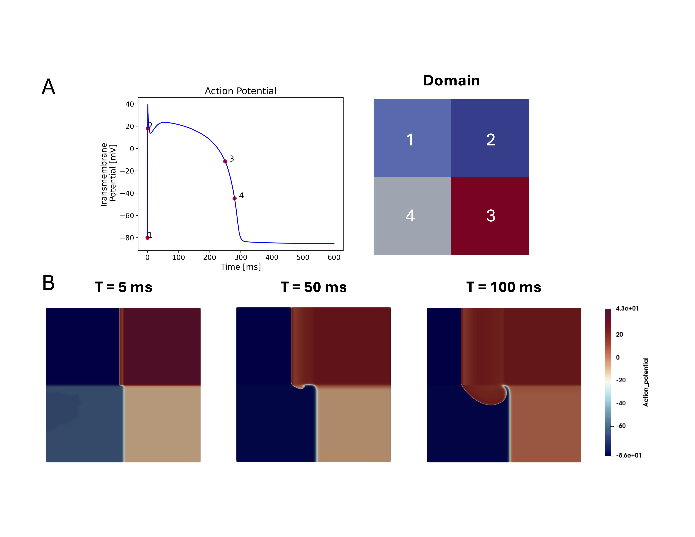

# Spiral Wave for TTP Model 

Another approach to spiral wave initialization is to 'rig' the simulation domain such that there are 4 sub-domains which are all initialized to different sets of ionic and gating variable states. A visualization of this simulation case is shown below

   

Each set of initial conditions parameters is defined in a seperate xml file that is included in the solver.xml via the `<Include_xml>` parameter. 
